Описание библиотеки функций и функциональных блоков
===================================================

Функции и функциональные блоки представляют собой предопределённые
элементы, которые могут быть использованы при написании алгоритмов и
логики программных модулей типа «Функциональный блок» и «Программа», как
на текстовых, так и на графических языках стандарта IEC 61131-3.

Данные элементы имеют параметры на входе и на выходе. Как правило,
каждый параметр имеет имя и своё назначение.

Стандартные функциональные блоки
--------------------------------

**Бистабильный SR-триггер**

Данный функциональный блок представляет собой бистабильный SR-триггер, с
доминирующим входом S (Set). Выход Q1 становится "1", когда вход S1
становится "1". Это состояние сохраняется, даже если S1 возвращается
обратно в "0". Выход Q1 возвращается в "0", когда вход R становится "1".
Если входы S1 и R находятся в "1" одновременно, доминирующий вход S1
установит выход Q1 в "1". Когда функциональный блок вызывается первый
раз, начальное состояние Q1 это "0".

**Бистабильный RS-триггер**

Данный функциональный блок представляет собой бистабильный RS-триггер, с
доминирующим входом R (Reset). Выход Q1 становится "1", когда вход S
становится "1". Это состояние сохраняется, даже если S возвращается
обратно в "0". Выход Q1 возвращается в "0", когда вход R1 становится
"1". Если входы S и R1 находятся в "1" одновременно, доминирующий вход
R1 установит выход Q1 в "0". Когда функциональный блок вызывается первый
раз, начальное состояние Q1 это "0".

**SEMA - Семафор**

Данный функциональный блок представляет собой семафор, определяющий
механизм, позволяющий элементам программы иметь взаимоисключающий доступ
к определенным ресурсам.

**R_TRIG - Индикатор нарастания фронта**

Данный функциональный блок представляет собой индикатор нарастания
фронта, который генерирует на выходе одиночный импульс при нарастании
фронта сигнала. Выход Q становится "1", если происходит переход из "0" в
"1" на входе CLK . Выход остается в состоянии "1" от одного выполнения
блока до следующего (один цикл); затем выход возвращается в "0".

**F_TRIG - Индикатор спада фронта**

Данный функциональный блок представляет собой индикатор спада фронта,
который генерирует на выходе одиночный импульс при спаде фронта сигнала.

Выход Q становится "1", если происходит переход из "1" в "0" на входе
CLK . Выход будет оставаться в состоянии "1" от одного выполнения блока
до следующего; затем выход возвращается в "0".

**CTU - инкрементный счётчик**

Данный функциональный блок представляет собой инкрементный счётчик.
Сигнал "1" на входе R вызывает присваивание значения "0" выходу CV . При
каждом переходе из "0" в "1" на входе CU значение CV увеличивается на 1.
Когда CV >= PV, выход Q устанавливается в "1".

Примечание: Счетчик работает только до достижения максимального значения
используемого типа данных. Переполнения не происходит.

Входы CU, RESET и выход Q типа BOOL, вход PV и выход CV типа WORD.

По каждому фронту на входе CU (переход из FALSE в TRUE) выход CV
увеличивается на 1. Выход Q устанавливается в TRUE, когда счетчик
достигнет значения заданного PV. Счетчик CV сбрасывается в 0 по входу
RESET = TRUE.

**CTD - декрементный счётчик**

Данный функциональный блок представляет собой декрементный счётчик.
Сигнал "1" на входе LD вызывает присваивание значения на входе PV выходу
CV . При каждом переходе из "0" в "1" на входе CD значение CV
уменьшается на 1.

Когда CV <= 0, выход Q принимает значение "1".

Примечание: Счетчик работает только до достижения минимального значения

используемого типа данных. Переполнения не происходит.

**CTUD - реверсивный счётчик**

Данный функциональный блок представляет собой реверсивный счётчик.
Сигнал "1" на входе R вызывает присваивание значения "0" выходу CV .
Сигнал "1" на входе LD вызывает присваивание значения на входе PV выходу
CV . При каждом переходе из "0" в "1" на входе CU значение CV
увеличивается на 1. При каждом переходе из "0" в "1" на входе CD
значение CV уменьшается на 1.

Если сигнал "1" приходит одновременно на входы R и LD, вход R
обрабатывается первым.

Когда CV >= PV, выход QU имеет значение "1".

Когда CV <= 0, выход QD принимает значение "1".

Примечание: Вычитающий счетчик работает только до достижения
минимального значения используемого типа данных, суммирующий счетчик
работает только до достижения максимального значения используемого типа
данных. Переполнения не происходит.

**TP - повторитель импульсов**

Данный функциональный блок представляет собой повторитель импульсов и
используется для генерирования импульса с заданной продолжительностью.
Если IN становится "1", Q становится "1", и начинается отсчет
внутреннего времени (ET). Если внутреннее время достигает значения PT, Q
становится "0" (независимо от IN). Отсчет внутреннего времени
останавливается/сбрасывается, если IN становится "0". Если внутреннее
время не достигло значения PT, импульс IN не влияет на внутреннее время.
Если внутреннее время достигло значения PT, и IN равен "0", отсчет
внутреннего времени останавливается/сбрасывается, и Q становится "0".

**TON - таймер с задержкой включения**

Данный функциональный блок представляет собой таймер с задержкой
включения. Он запускается, когда состояние сигнала на входе меняется от
0 к 1 и устанавливает на выходе 1 по истечении заданного времени.

Если IN становится "1", запускается отсчет внутреннего времени (ET).
Если внутреннее время достигает значения PT, Q становится "1". Если IN
становится "0", Q становится "0", а подсчет внутреннего времени
останавливается/сбрасывается. Если IN становится "0" до того, как
внутреннее время достигло значения PT, подсчет внутреннего времени
останавливается/сбрасывается, а выход Q не устанавливается в "0".

**TOF - таймер с задержкой отключения**

Данный функциональный блок представляет собой таймер с задержкой
отключения. Он запускается, когда состояние сигнала на входе меняется от
1 к 0 и устанавливает на выходе 0 по истечении заданного времени.

Если IN становится "1", Q становится "1".

Если IN становится "0", запускается отсчет внутреннего времени (ET).

Если внутреннее время достигает значения PT, Q становится "0".

Если IN становится "1", Q становится "1", а подсчет внутреннего времени
останавливается/сбрасывается.

Если IN становится "1" до того, как внутреннее время достигло значения
PT, подсчет внутреннего времени останавливается/сбрасывается, а выход Q
не устанавливается в "0".

Дополнительные функциональные блоки
-----------------------------------

**RTC - часы реального времени**

Данный функциональный блок представляет собой часы реального времени и
имеет много вариантов использования, включая добавление временных
отметок, для установки даты и времени в формируемых отчетах, в аварийных
сообщениях и т.д.

Вход PDT (Preset DT) предназначен для установки времени. Часы начинают
отсчет времени от значения PDT. Выход Q (BOOL) повторят значение EN.
Выход CDT (Current DT) дает текущее значение даты и времени.

**INTEGRAL - Интеграл**

Функциональный блок интеграл интегрирует входное значение XIN по
времени.

**DERIVATIVE - Производная**

Функциональный блок производная выдаёт значение XOUT пропорционально
скорости изменения входного параметра XIN.

**PID - Пропорционально-интегрально-дифференциальный регулятор**

Данный функциональный блок представляет собой устройство в цепи обратной
связи, используемое в системах автоматического управления для
формирования управляющего сигнала. ПИД-регулятор формирует управляющий
сигнал, являющийся суммой трёх слагаемых, первое из которых
пропорционально входному сигналу, второе - интеграл входного сигнала,
третье - производная входного сигнала.

**HYSTERESIS - гистерезис**

Функциональный блок гистерезис предоставляет выходное гистерезисное
булевское значение, которое определяется разницей вводных параметров
XIN1 и XIN2 (типа REAL с плавающей точкой).

Числовые операции
-----------------

**ABS - модуль числа**

Данная функция возвращает в OUT модуль входного числа IN.

**SQRT - квадратный корень**

Данная функция возвращает в OUT квадратный корень входного числа IN.

**LN - натуральный логарифм**

Данная функция возвращает в OUT значение натурального логарифма от IN.

**LOG - логарифм по основанию 10**

Данная функция возвращает в OUT значение логарифма по основанию 10 от
IN.

**EXP - возведение в степень экспоненты**

Данная функция возвращает в OUT значение экспоненты, возведённой в
степень IN.

**SIN - синус**

Данная функция возвращает в OUT значение синуса IN.

**COS - косинус**

Данная функция возвращает в OUT значение косинуса IN.

**TAN - тангенс**

Данная функция возвращает в OUT значение тангенса IN.

**ASIN - арксинус**

Данный функциональный блок возвращает в OUT значение арксинуса IN.

**ACOS - арккосинус**

Данная функция возвращает в OUT значение арккосинуса IN.

**ATAN - арктангенс**

Данная функция возвращает в OUT значение арктангенса IN.

Арифметические операции

**ADD - сложение**

Данная функция возвращает в OUT результат сложения IN1 и IN2.

**MUL - умножение**

Данная функция возвращает в OUT результат умножения IN1 и IN2.

**SUB - вычитание**

Данная функция возвращает в OUT результат вычитания из IN1 значения IN2.

**DIV - деление**

Данная функция возвращает в OUT результат деления IN1 на IN2.

**MOD - остаток от деления**

Данная функция возвращает в OUT остаток от деления IN1 на IN2.

**EXPT - возведение в степень**

Данная функция возвращает в OUT значение IN1 возведённое в степень IN2.

**MOVE - присвоение**

Данная функция возвращает в OUT значение IN.

Временные операции
------------------

**ADD_TIME - сложение переменных типа TIME**

Данная функция складывает входные значения IN(k) типа TIME и возвращает
результат в OUT типа TIME. Количество входов IN(n) изменяемое - от 2 до
20. По умолчанию 2.

**ADD_TOD_TIME - сложение времени дня TOD с интервалом времени TIME**

Данная функция складывает входную переменную IN1 типа TOD (TIME_OF_DAY)
с переменной IN2 типа TIME. Возвращаемая величина OUT имеет тип
TIME_OF_DAY.

**ADD_DT_TIME - прибавление промежутка времени TIME к моменту времени DT**

Данная функция ADD_DT_TIME прибавляет промежуток времени (формат TIME) к
моменту времени (формат DT) и поставляет в качестве результата новый
момент времени (формат DT). Момент времени (параметр T) должен лежать в
диапазоне от DT#1990-01-01-00:00:00.000 до DT#2089-12-31-23:59:59.999.

Функция не выполняет входной проверки. Если результат сложения не лежит
внутри допустимого диапазона, то результат ограничивается
соответствующим значением и бит двоичного результата (BR) слова
состояния устанавливается в "0".

Для входного параметра Т и выходного параметра можно ставить в
соответствие только символически определенную переменную.

**MULTIME - умножение времени TIME на число**

Данная функция выполняет умножение входного значения IN1 типа TIME на
число IN2 типа ANY_NUM и возвращает результат в OUT типа TIME.

**SUB_TIME - разность двух значений типа TIME**

Данная функция вычитает из входного значения IN1 типа TIME значение на
входе IN2 типа TIME и возвращает результат в OUT типа TIME.

**SUB_DATE_DATE - разность двух значений типа DATE**

Данная функция вычитает из входного значения IN1 типа DATE входное
значение IN2 типа DATE и возвращает в OUT их разницу типа TIME.

**SUB_TOD_TIME - вычитание из времени дня TOD интервала времени TIME**

Данная функция вычитает из входного значения IN1 типа TOD (TIME_OF_DAY)
входное значение IN2 типа TIME и возвращает результат в OUT типа
TIME_OF_DAY.

**SUB_DT_TIME - вычитание из момента времени DT промежутка времени TIME**

Данная функция вычитает промежуток времени (формат TIME) из момента
времени (формат DT) и поставляет в качестве результата новый момент
времени (формат DT). Момент времени (параметр T) должен лежать в
диапазоне от DT#1990-01-01-00:00:00.000 до DT#2089-12- 31-23:59:59.999.
Функция не выполняет входной проверки. Если результат вычитания не лежит
внутри допустимого диапазона, то результат ограничивается
соответствующим значением и бит двоичного результата (BR) слова
состояния устанавливается в "0".

Для входного параметра Т и выходного параметра можно ставить в
соответствие только символически определенную переменную.

**DIVTIME - деление времени TIME на число**

Данная функция выполняет деление входного значения IN1 типа TIME на
число IN2 типа ANY_NUM и возвращает результат в OUT типа TIME.

Операции смещения бит

**SHL - арифметический сдвиг влево**

Данная функция возвращает в OUT арифметический сдвиг аргумента IN на N
бит влево с заполнением битов справа нулями.

**SHR - арифметический сдвиг вправо**

Данная функция возвращает в OUT арифметический сдвиг аргумента IN на N
бит вправо с заполнением битов слева нулями.

**ROR - циклический сдвиг направо**

Данная функция возвращает в OUT циклический сдвиг аргумента IN на N бит
влево.

**ROL - циклический сдвиг влево**

Данная функция возвращает в OUT циклический сдвиг аргумента IN на N бит
вправо.

Побитовые операции
------------------

**AND - побитовое И**

Данный функциональный блок представляет собой организацию «логического
И» для всех входных аргументов IN\ :sub:`1`\ …IN\ :sub:`n`.

**OR - побитовое ИЛИ**

Данная функция представляет собой организацию «логического ИЛИ» для всех
входных аргументов IN\ :sub:`1`\ …IN\ :sub:`n`.

**XOR - побитовое исключающее ИЛИ**

Данная функция представляет собой организацию «логического исключающего
ИЛИ» для всех входных аргументов IN\ :sub:`1`\ …IN\ :sub:`n`.

**NOT - побитовая инверсия**

Данная функция представляет собой организацию «логической инверсии» для
входного аргумента IN.

Операции выбора

**SEL - выбор из двух значений**

Данная функция возвращает в OUT один из двух аргументов IN1 или IN2 в
зависимости от значения аргумента G. Если G = 0, то OUT равно Х1, иначе
- OUT равно X2.

**MAX - максимум**

Данная функция возвращает в OUT максимум из входных аргументов IN1 и
IN2.

**MIN - минимум**

Данная функция возвращает в OUT минимум из входных аргументов IN1 и IN2.

**LIMIT - ограничитель значения**

Данная функция возвращает в OUT значение входного аргумента IN, в случае
превышения им значения MX - в OUT возвращается MX, в случае если IN
меньше MN - в OUT возвращается MN.

**MUX - Мультиплексор (выбор 1 из N)**

Данная функция возвращает в OUT значение на входе IN(K), в зависимости
от входного K. Количество входов IN\:sub:`(n)` изменяемое - от 2 до 20. По
умолчанию 2.

Операции сравнения
------------------

**GT - больше чем**

Данная функция сравнивает все входные аргументы и выдаёт на выходе OUT
значение True, если выполнится следующее условие: (IN1 > IN2) & (IN2 >
IN3) & ... (IN\ :sub:`n-1` > IN\ :sub:`n`), в противном случае в OUT
выдаётся False. Количество входов IN\ :sub:`(n)` изменяемое - от 2 до
20. По умолчанию 2.

**GE - больше чем или равно**

Данная функция сравнивает все входные аргументы и выдаёт на выходе OUT
значение True, если выполнится следующее условие: (IN1 >= IN2) & (IN2 >=
IN3) & ... (IN\ :sub:`n-1` >= IN\ :sub:`n`), в противном случае в OUT
выдаётся False. Количество входов IN\ :sub:`(n)` изменяемое - от 2 до
20. По умолчанию 2.

**EQ - равенство**

Данная функция сравнивает все входные аргументы и выдаёт на выходе OUT
значение True, если выполнится следующее условие: (IN1 = IN2) & (IN2 =
IN3) & ... (IN\ :sub:`n-1` = IN\ :sub:`n`), в противном случае в OUT
выдаётся False. Количество входов IN\ :sub:`(n)` изменяемое - от 2 до
20. По умолчанию 2.

**LT - меньше чем**

Данная функция сравнивает все входные аргументы и выдаёт на выходе OUT
значение True, если выполнится следующее условие: (IN1 < IN2) & (IN2 <
IN3) & ... (IN\ :sub:`n-1` < IN\ :sub:`n`), в противном случае в OUT выдаётся
False. Количество входов IN\ :sub:`(n)` изменяемое - от 2 до 20. По
умолчанию 2.

**LE - меньше чем или равно**

Данная функция сравнивает все входные аргументы и выдаёт на выходе OUT
значение True, если выполнится следующее условие: (IN1 <= IN2) & (IN2 <=
IN3) & ... (IN\ :sub:`n-1` <= IN\ :sub:`n`), в противном случае в OUT выдаётся
False. Количество входов IN\ :sub:`(n)` изменяемое - от 2 до 20. По
умолчанию 2.

**NE - не равно**

Данная функция сравнивает все входные аргументы и выдаёт на выходе OUT
значение True, если выполнится следующее условие: (IN1 <> IN2) & (IN2 <>
IN3) & ... (IN\ :sub:`n-1` <> IN\ :sub:`n`), в противном случае в OUT
выдаётся False. Количество входов IN\ :sub:`(n)` изменяемое - от 2 до 20. По
умолчанию 2.

Строковые операции с переменными типа STRING
--------------------------------------------

**LEN - длина строки**

Данная функция возвращает в OUT длину строки IN. Входному параметру
можно ставить в соответствие только символически определенную
переменную.

**LEFT - левая часть строки**

Данная функция возвращает в OUT из строки IN первые L символов. Если L
больше, чем текущая длина переменной типа STRING, то возвращается
входное значение. При L = 0 и при пустой строке в качестве входного
значения возвращается пустая строка. Если число L отрицательно, то
выводится пустая строка. Параметру IN и возвращаемому значению можно
ставить в соответствие только символически определенную переменную.

**RIGHT - правая часть строки**

Данная функция возвращает в OUT из строки IN последние L символов. Если
L больше, чем текущая длина переменной STRING, то возвращается входное
значение. При L = 0 и при пустой строке в качестве входного значения
возвращается пустая строка. Если число L отрицательно, то выводится
пустая строка. Параметру IN и возвращаемому значению можно ставить в
соответствие только символически определенную переменную.

**MID - середина строки**

Данная функция возвращает в OUT из строки IN L-символов, начиная с
позиции P. Если сумма L и (P-1) превосходит текущую длину переменной
типа STRING, то возвращается строка символов, начиная с P-го символа
входной строки до ее конца. Во всех остальных случаях (P находится вне
текущей длины, P и/или L равны нулю или отрицательны) выводится пустая
строка. Параметру IN и возвращаемому значению можно ставить в
соответствие только символически определенную переменную.

**CONCAT - объединение двух переменных STRING**

Данная функция возвращает в OUT объединение (конкатенацию) строк IN1 и
IN2.

**CONCAT_DAT_TOD - объединение (конкатенация) времени**

Данная функция возвращает в OUT типа DT конкатенацию входных значений
типов DATE и TOD, соответственно IN1 и IN2.

**INSERT - вставка в переменной STRING**

Данная функция возвращает в OUT строку IN1, в которую вставлена строка
IN2, начиная с позиции P. Если P равно нулю, то вторая строка символов
вставляется перед первой строкой символов. Если P больше, чем текущая
длина первой строки символов, то вторая строка символов присоединяется к
первой. Если P отрицательно, то выводится пустая строка. Входным
параметрам IN1 и IN2 и выходному параметру можно ставить в соответствие
только символически определенную переменную.

**DELETE - удаление в переменной STRING**

Данная функция возвращает в OUT строку IN1, в которой удалено L
символов, начиная с позиции P. Если L и/или P равны нулю или P больше,
чем текущая длина входной строки, то возвращается входная строка. Если
сумма L и P больше, чем входная строка символов, то строка символов
удаляется до конца. Если L и/или P имеют отрицательное значение, то
выводится пустая. Входному параметру IN и выходному параметру можно
ставить в соответствие только символически определенную переменную.

**REPLACE - замена в переменной STRING**

Данная функция возвращает в OUT строку IN1, в которой символы, начиная с
позиции P, заменены L первыми символами строки IN2. Если L равно нулю,
то возвращается первая строка символов. Если P равно нулю или единице,
то замена происходит, начиная с 1-го символа (включительно). Если P
лежит вне первой строки символов, то вторая строка присоединяется к
первой строке. Если L и/или P отрицательны, то возвращается пустая
строка. Входным параметрам IN1 и IN2 и выходному параметру можно ставить
в соответствие только символически определенную переменную.

**FIND - поиск в переменной STRING**

Данная функция возвращает в OUT номер позиции, в которой находится
строка IN2 в строке IN1. Поиск начинается слева, сообщается о первом
появлении строки символов. Если вторая строка символов не содержится в
первой, то возвращается нуль. Входным параметрам IN1 и IN2 можно ставить
в соответствие только символически определенную переменную.

.. |image3| image:: ./media/image4.png
   :width: 0.27153in
   :height: 0.27153in
.. |image4| image:: ./media/image5.png
   :width: 0.27153in
   :height: 0.27153in
.. |image5| image:: ./media/image6.png
   :width: 0.27153in
   :height: 0.27153in
.. |image6| image:: ./media/image7.png
   :width: 0.27153in
   :height: 0.27153in
.. |image7| image:: ./media/image8.png
   :width: 0.27153in
   :height: 0.27153in
.. |image8| image:: ./media/image9.png
   :width: 0.27153in
   :height: 0.27153in
.. |image9| image:: ./media/image10.png
   :width: 0.27153in
   :height: 0.27153in
.. |image10| image:: ./media/image11.png
   :width: 0.27153in
   :height: 0.27153in
.. |image11| image:: ./media/image12.png
   :width: 0.27153in
   :height: 0.27153in
.. |image12| image:: ./media/image13.png
   :width: 0.27153in
   :height: 0.27153in

.. |image15| image:: ./media/image16.png
   :width: 0.27153in
   :height: 0.27153in
.. |image16| image:: ./media/image17.png
   :width: 0.27153in
   :height: 0.27153in
.. |image17| image:: ./media/image18.png
   :width: 0.27153in
   :height: 0.27153in
.. |image18| image:: ./media/image19.png
   :width: 0.27153in
   :height: 0.27153in
.. |image19| image:: ./media/image20.png
   :width: 0.27153in
   :height: 0.27153in
.. |image20| image:: ./media/image21.png
   :width: 0.27153in
   :height: 0.27153in
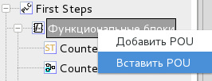
.. |image39| image:: ./media/image37.png
   :width: 0.27153in
   :height: 0.27153in
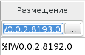
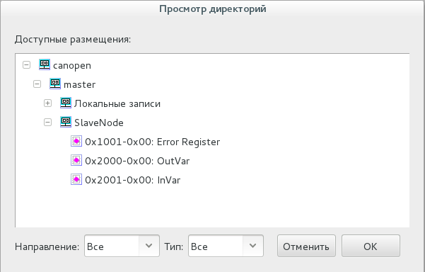
.. |image44| image:: ./media/image42.png
   :width: 0.27153in
   :height: 0.27153in
.. |image45| image:: ./media/image43.png
   :width: 0.27153in
   :height: 0.27153in
.. |image52| image:: ./media/image50.png
   :width: 0.27153in
   :height: 0.27153in
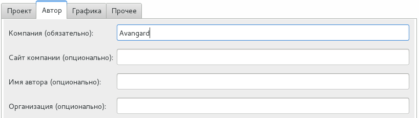
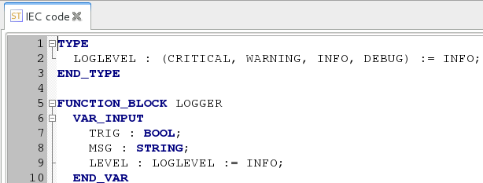
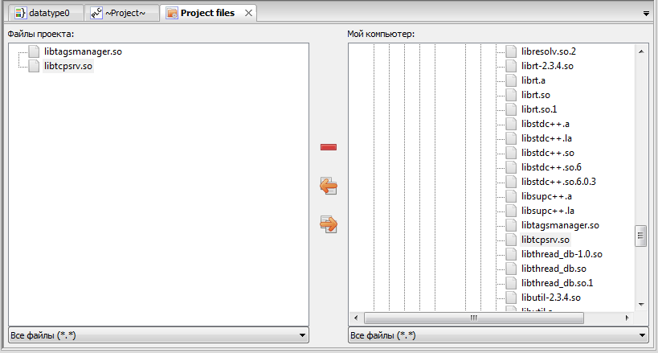
.. |image58| image:: ./media/image56.png
   :width: 0.27153in
   :height: 0.27153in
.. |image59| image:: ./media/image57.png
   :width: 0.27153in
   :height: 0.27153in
.. |image60| image:: ./media/image58.png
   :width: 0.27153in
   :height: 0.27153in
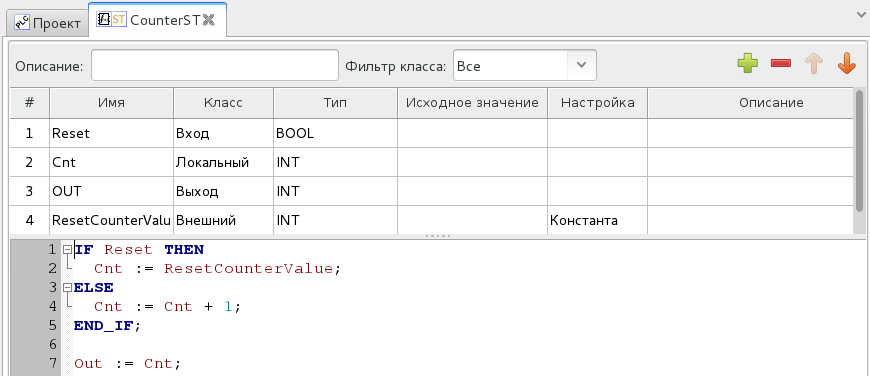
.. |image74| image:: ./media/image72.png
   :width: 0.26458in
   :height: 0.26458in
.. |image75| image:: ./media/image73.png
   :width: 0.26458in
   :height: 0.26458in
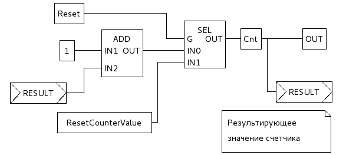
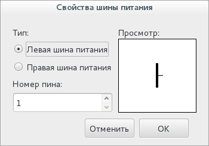
.. |image86| image:: ./media/image84.png
   :width: 0.26458in
   :height: 0.26458in
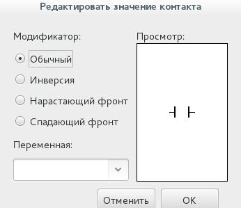
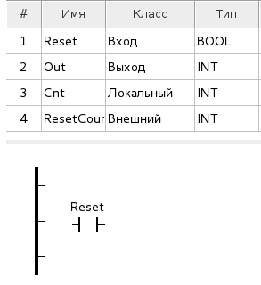
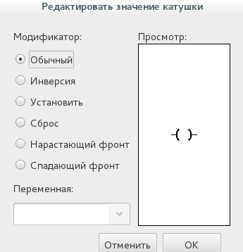
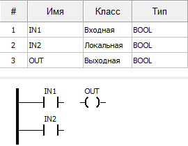
.. |image129| image:: ./media/image121.png
   :width: 0.29167in
   :height: 0.29167in
.. |image130| image:: ./media/image121_1.png
   :width: 0.27778in
   :height: 0.27761in
.. |image131| image:: ./media/image121_2.png
   :width: 0.27083in
   :height: 0.27753in

.. |image154| image:: ./media/image141.png
   :width: 0.26736in
   :height: 0.26736in
.. |image155| image:: ./media/image142.png
   :width: 0.26736in
   :height: 0.26736in
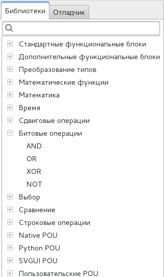
