Обращение к программе. Входные и выходные данные
================================================

Общая схема по созданию прикладной программы в среде разработки Beremiz
представлена на рис. 1. Входными данными являются программные модули,
написанные пользователем (в большинстве случаев инженером по
автоматизации) на текстовых (ST, IL) и/или графических (FBD, SFC, LD)
языках в соответствии со стандартом IEC 61131-3, объединённые в проект.
Каждый такой проект представлен в формате XML и хранится в отдельной
папке.

Выходными данными является сгенерированный исходный код и исполняемый
файл:

-  Файл <название проекта> содержащий промежуточный код на языке ST,
   сгенерированный для всех программных модулей и ресурсов,
   транслируемый в язык C;

-  Файлы: config.c config.h, POUS.h, POUS.c и файлы, соответствующие
   ресурсам - содержат код (на языке C) реализации алгоритмов и логики
   работы программных модулей и ресурсов проекта;

-  Файлы plc_common_main.c и plc_debugger.c содержат код специфичный для
   целевой архитектуры и код для отладки прикладной программы на целевом
   устройстве из среды разработки Beremiz соответственно;

-  Файлы, содержащие код драйверов на языке С для взаимодействия с
   внешними модулями УСО;

-  Исполняемый файл в виде динамической библиотеки (с расширением so),
   компилируемый из этих вышеперечисленных C файлов.

Сгенерированный C код, с помощью кросскомпилятора, запущенного под
UNIX-подобной оболочкой, компилируется в исполняемый бинарный файл,
представленный в виде библиотеки.

Исполняемый файл, благодаря средствам Beremiz, может быть размещен на
целевом устройстве через локальную сеть.

На целевом устройстве исполняемый файл запускается и в процессе работы
выполняет следующие действия (см. :numref:`image1`):

-  С помощью драйверов модулей УСО обменивается данными с внешними
   модулями;

-  Исполняет алгоритмы и логику, определенную пользователем в
   программных модулях проекта;

-  Предоставляет данные для трансляции в системы верхнего уровня;

-  Сохраняет и транслирует информацию для отладки прикладных программ.

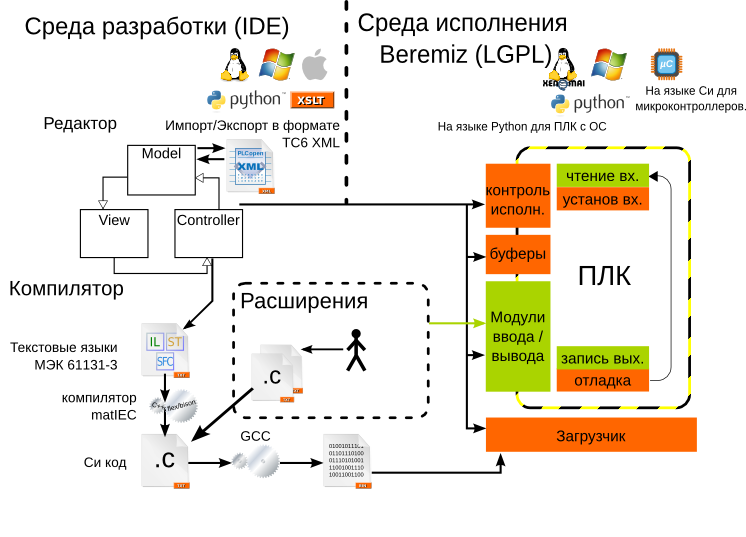

   \- Обобщенная схема инструментальной среды Beremiz

Основные термины и определения
==============================

**IEC 61131-3** - раздел международного стандарта МЭК 61131 (также
существует соответствующий европейский стандарт EN 61131), описывающий
языки программирования для программируемых логических контроллеров.

**Среда разработки для языков стандарта IEC 61131-3** - система
программных средств, используемая инженерами по автоматизации, для
разработки прикладного программного обеспечения на высокоуровневых
языках стандарта IEC 61131-3 под различные целевые платформы, которая
включает в себя:

Текстовые и графические редакторы языков стандарта IEC 61131-3;

Транслятор диаграмм графических языков в текстовый язык;

Транслятор текстового языка в язык C;

Механизмы плагинов для взаимодействия с модулями УСО;

Механизмы добавления компиляторов под целевую платформу;

Механизмы соединений с целевыми устройствами;

Отладчик.

**Модули УСО** - модули ввода/вывода, обеспечивающие подключение
датчиков и исполнительных механизмов.

**Целевое устройство** - аппаратное средство с определённой архитектурой
процессора, на котором могут исполняться различные исполняемые файлы,
обращающиеся с помощью него к модулям УСО.

**Плагин для модуля УСО** - интерфейс, состоящий из специальных
драйверов и элементов пользовательского интерфейса для среды разработки
Beremiz, позволяющий связывать переменные модулей УСО с переменными
программных модулей, из которых состоит проект.

**Проект** - совокупность программных модулей (программ, функциональных
блоков, функций), плагинов внешних модулей УСО, ресурсов,
пользовательских типов данных, сборка (компиляция и компоновка) которых,
представляет собой прикладную программу для целевого устройства. Каждый
проект сохраняется в отдельном файле.

**Переменная** - область памяти, в которой находятся данные, с которыми
оперирует программный модуль.

**Ресурс** - элемент, отвечающий за конфигурацию проекта: глобальные
переменные и экземпляры проекта, связываемыми с программными модулями
типа «Программа» и задачами.

**Программный модуль** - элемент, представляющий собой функцию,
функциональный блок или программу. Каждый программный модуль состоит из
раздела объявлений и кода. Для написания всего кода программного
используется только один из языков программирования стандарта IEC
61131-3.

**Функция** - программный модуль, который возвращает только единственное
значение, которое может состоять из одного и нескольких элементов (если
это битовое поле или структура).

**Функциональный блок** - программный модуль, который принимает и
возвращает произвольное число значений, а так же позволяет сохранять
своё состояние (подобно классу в различных объектно-ориентированных
языках). В отличие от функции функциональный блок не формирует
возвращаемое значение.

**Программа** - программный модуль, представляющий собой единицу
исполнения, как правило, связывается (ассоциируется) с задачей.

**Задача** - элемент представляющий время и приоритет выполнения
программного модуля типа «Программа» в рамках экземпляра проекта.

**Экземпляр** - представляет собой программу, как единицу исполнения,
связанную (ассоциированную) с определённой задачей. Так же, как
экземпляр, рассматриваются переменные, определённые в программных
модулях: программа и функциональный блок.

**Пользовательский тип данных** - тип данных, добавленный в проект и
представляющий собой: псевдоним существующего типа, поддиапазон
существующего типа, перечисление, массив или структуру.

Основные компоненты среды Beremiz
=================================

Пользовательский интерфейс среды разработки Beremiz состоит из следующих
компонент:

-  Главное меню программы;

-  Панель инструментов;

-  Дерево проекта;

-  Панель списка переменных и констант;

-  Панель настроек проекта;

-  Панель файлов проекта;

-  Панель отображения промежуточного кода;

-  Текстовые редакторы языков ST и IL;

-  Графические редакторы языков FBD, SFC, LD;

-  Панель редактирования ресурса;

-  Панель экземпляров проекта;

-  Панель библиотеки функций и функциональных блоков;

-  Отладочная консоль;

-  Поиск элементов в проекте;

-  Панель отладки;

-  Панель графика изменения значения переменной в режиме отладки.

Далее подробно рассказано про каждый компонент среды разработки Beremiz
в отдельности.

Главное меню программы
----------------------

Главное меню программы (см. :numref:`image2`) содержит следующие пункты:

-  «Файл»;

-  «Редактировать»;

-  «Вид»;

-  «Помощь».

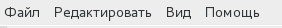

   \– Главное меню программы

Часть операций, выполняемых с помощью выбора определённого пункта меню
мышью, могут быть исполнены с помощью «горячих клавиш». На выбор
пользователя представлено два механизма обработки горячих клавиш. Первый
механизм использует первые буквы названия пунктов меню, для выбора
пункта необходимо нажать (ALT + ‘Клавиша первой буквы названия пункта в
главном меню’) затем можно выбрать операцию или подменю, нажав на
клавиатуре первую букву названия соответствующего пункта. Второй
механизм использует установленные клавиатурные сочетания, далее будет
подробно описан каждый пункт меню и соответствующая ему (если
определена) «горячая клавиша».

Меню «Файл» предназначено для работы с проектом и предоставляет
следующие пункты:

-  «Новый» - создание нового проекта (CTRL + N);

-  «Открыть» - открытие существующего проекта (CTRL + O);

-  «Недавние проекты» - быстрое открытие одного из десяти последних,
   недавно редактированных проектов;

-  «Сохранить» - сохранение текущего проекта пункт (CTRL + S);

-  «Сохранить как» - сохранение текущего проекта в папку отличную от
   той, в которой он сохранён на данный момент (CTRL + SHIFT + S);

-  «Закрыть вкладку» - закрытие активной вкладки (например, вкладки
   переменных плагина, конфигурации и т.д.) для открытого проекта (CTRL
   + W);

-  «Закрыть проект» - закрыть текущий, открытый проект (CTRL + SHIFT +
   W);

-  «Настройки страницы» - настройка параметров страницы для печати на
   принтере активной программы, представленной в виде диаграммы (CTRL +
   ALT + P);

-  «Просмотр» - предварительный просмотр результата перед печатью на
   принтере активной программы (CTRL + SHIFT + P);

-  «Печать» - печать на принтере активной программы (CTRL + P);

-  «Выход» - закрытие текущего проекта и выход из программы Beremiz
   (CTRL+ Q).

-  Меню «Редактировать» предназначено для работы с редакторами языков
   стандарта МЭК 61131-3 и предоставляет следующие возможности:

-  «Отмена» - отмена последней манипуляции в редакторе (CTRL + Z);

-  «Повторить» повтор отменённой манипуляции в редакторе (CTRL + Y);

-  «Вырезать» - удалить в буфер обмена выделенный(е) элемент(ы) в
   редакторе (CTRL + X);

-  «Копировать» - копировать в буфер обмена выделенный(е) элемент(ы) в
   редакторе (CTRL + C);

-  «Вставить» - вставить из буфера обмена находящиеся там элемент(ы) в
   редактор (CTRL + V);

-  «Поиск» - поиск в текущем функциональном блоке (CTRL + F);

-  «Поиск следующего» - подсветка следующего вхождения строки поиска
   (CTRL+K);

-  «Поиск предыдущего» - подсветка предыдущего вхождения строки поиска
   (CTRL + SHIFT + K);

-  «Поиск в проекте» - вызов диалога поиска данных в проекте (CTRL +
   SHIFT + F);

-  «Добавить элемент» - добавление одного из следующих элемента в
   текущий проект:

-  «Тип данных» - нового типа данных;

-  «Функция» - новой функции;

-  «Функциональный блок» - нового функционального блока;

-  «Программа» - новую программу;

-  «Ресурс» - новый ресурс;

-  плагины для модулей УСО;

-  «Выделить всё» - выделение всех элементов в активной вкладке
   редактора (CTRL +A);

-  «Удалить» - удаление программного модуля, выделенного в дереве
   проекта.

Меню «Вид» предназначено для работы с редакторами языков стандарта
IEC-61131 и предоставляет следующие возможности:

-  «Обновить» - обновление данных и снятие выделения в редакторе (CTRL +
   R);

-  «Очистить ошибки» - очистка указателей ошибок в редакторе (CTRL + K);

-  «Приближение» - пункт, в котором можно выбрать в процентах величину
   масштаба;

-  «Сменить представление» - убирает все панели, оставляя только рабочее
   поле(F12)

-  «Сброс расположения панелей» - восстановление расположения панелей
   Beremiz в исходное состояние.

Меню «Помощь» предназначено для обращения к выводу информации в виде
диалога о создателях данной среды - пункт «О программе».

Панель инструментов
-------------------

Панель инструментов представляет собой панель с кнопками для быстрого
обращения к часто используемым функциям среды разработки Beremiz. Она
состоит из нескольких панелей, содержащих кнопки: главного меню, сборки
проекта и установки связи с целевым устройством. Подробнее об этих
панелях рассказано ниже. При редактировании программных модулей,
написанных на графических языках, появляются дополнительные панели с
кнопками. Они рассмотрены при описании редакторов графических языков
стандарта IEC 61131-3 (см. п. 5.7).

Кнопки главного меню

Панель инструментов, содержащая кнопки главного меню представлена на
:numref:`image3`.

Список кнопок и их функций описывается в таблице 1.

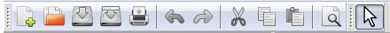

   \– Панель инструментов

Таблица 1 – Кнопки панели инструментов

+-----------------------+-----------------------+-----------------------+
| Внешний вид кнопки    | Название кнопки       | Функция кнопки        |
+=======================+=======================+=======================+
| |image3|              | Новый проект          | Создать новый проект  |
+-----------------------+-----------------------+-----------------------+
| |image4|              | Открыть проект        | Открыть существующий  |
|                       |                       | проект                |
+-----------------------+-----------------------+-----------------------+
| |image5|              | Сохранить             | Сохранить текущий     |
|                       |                       | проект                |
+-----------------------+-----------------------+-----------------------+
| |image6|              | Сохранить как         | Сохранить текущий     |
|                       |                       | проект в определенную |
|                       |                       | папку                 |
+-----------------------+-----------------------+-----------------------+
| |image7|              | Печать                | Печать на принтере    |
|                       |                       | текущей программы     |
+-----------------------+-----------------------+-----------------------+
| |image8|              | Отмена                | Отмена последней      |
|                       |                       | манипуляции в         |
|                       |                       | редакторе             |
+-----------------------+-----------------------+-----------------------+
| |image9|              | Повторить             | Повтор отмененной     |
|                       |                       | манипуляции в         |
|                       |                       | редакторе             |
+-----------------------+-----------------------+-----------------------+
| |image10|             | Вырезать              | Удалить в буфер       |
|                       |                       | обмена выделенные в   |
|                       |                       | редакторе фрагменты   |
+-----------------------+-----------------------+-----------------------+
| |image11|             | Вставить              | Вставить фрагменты из |
|                       |                       | буфера обмена в       |
|                       |                       | редактор              |
+-----------------------+-----------------------+-----------------------+
| |image12|             | Поиск в проекте       | Вызов диалога поиска  |
|                       |                       | данных в проекте      |
+-----------------------+-----------------------+-----------------------+

Кнопки сборки проекта и установки связи с целевым устройством

Панель, содержащая кнопки сборки проекта и соединения с целевым
устройством, позволяет скомпилировать и скомпоновать текущий проект и, в
случае, если эта операция завершилась успешно (данную информацию можно
увидеть в отладочной консоли (см. п. 5.12.)), передать и запустить
полученный исполняемый файл на целевом устройстве.

Часть кнопок данной панели показана на :numref:`image14`.

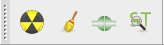

   \– Панель сборки проекта и соединения с целевым устройством

Таблица 2 – Кнопки сборки проекта и связи с целевым устройством на
панели инструментов

+-----------------------+-----------------------+-----------------------+
| Внешний вид кнопки    | Название кнопки       | Функция кнопки        |
+=======================+=======================+=======================+
| |image14|             | Сборка проекта в      | Полная                |
|                       | директории сборки     | сборка(компиляция и   |
|                       |                       | компоновка) текущего  |
|                       |                       | проекта в папку       |
|                       |                       | build, находящийся в  |
|                       |                       | папке, где хранится   |
|                       |                       | проект                |
+-----------------------+-----------------------+-----------------------+
| |image15|             | Очистить директорию   | Удаление папки build, |
|                       | сборки проекта        | где был собран проект |
+-----------------------+-----------------------+-----------------------+
| |image16|             | Подключиться к        | Соединиться с целевым |
|                       | целевому ПЛК          | устройством по адресу |
|                       |                       | URI, который был      |
|                       |                       | указан в настройках   |
|                       |                       | проекта               |
+-----------------------+-----------------------+-----------------------+
| |image17|             | Показать код,         | Показать код          |
|                       | сгенерированный       | скомпилированного     |
|                       | PLCGenerator          | проекта языке ST      |
+-----------------------+-----------------------+-----------------------+
| |image18|             | Передать ПЛК          | Перенести исполняемый |
|                       |                       | файл, полученный в    |
|                       |                       | ходе сборки проекта,  |
|                       |                       | на целевое устройство |
+-----------------------+-----------------------+-----------------------+
| |image19|             | Запустить ПЛК         | Запустить на          |
|                       |                       | исполнение собранную  |
|                       |                       | прикладную программу  |
|                       |                       | на целевом устройстве |
+-----------------------+-----------------------+-----------------------+
| |image20|             | Остановить запущенный | Остановить исполнение |
|                       | ПЛК                   | прикладной программы  |
|                       |                       | на целевом устройстве |
+-----------------------+-----------------------+-----------------------+

В зависимости от того, произведено в настоящий момент времени соединение
с целевым устройством или выполняется ли прикладная программа на нём,
появляются и скрываются некоторые кнопки.

На :numref:`image22` приведено состояние данной в панели, когда соединение с
целевым устройством установлено и на нём уже есть прикладная программа.
Соответственно, можно запустить с помощью кнопки «Запуск прикладной
программы» её или передать новую, используя кнопку «Передача прикладной
программы».

.. figure:: ./media/image22.png
   :name: image22
   :align: center
   :figclass: align-center
   :width: 2.39097in
   :height: 0.44792in

   \- Панель инструментов сборки проекта и соединения с целевым устройством

В случае, когда при установке соединения произошли ошибки, данная
информация будет выведена в отладочную консоль. Далее
будет рассмотрен компонент «Дерево проекта», который представляет
структуру элементов, составляющих проект.

Дерево проекта
--------------

Дерево проекта обычно расположено в левой части окна среды разработки
Beremiz (см. :numref:`image23`) и отображает структуру элементов, из которых
состоит проект.

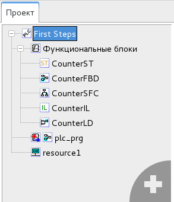

   \– Дерево проекта

В роли элементов могут выступать:

-  Ресурсы;

-  Программные модули (функции, функциональные блоки и программ) и их
   составные части;

-  Типы данных;

-  Плагины модулей УСО.

Дерево проекта позволяет добавлять, удалять элементы. Операции
копирования и вставки только доступны для программных модулей.

Добавление элемента в дерево проекта

В правом нижнем углу дерева проекта находится кнопка «+» (см. :numref:`image24`),
при нажатии на которую, появляется меню для выбора добавления
необходимого элемента в проект.

.. figure:: ./media/image24.png
   :name: image24
   :align: center
   :figclass: align-center
   :width: 3.31458in
   :height: 4.57569in

   \– Всплывающее меню добавления элементов проекта

В случае добавления программного модуля, т.е. выбора пункта «Функция»,
«Функциональный блок» или «Программа», появится диалог «Создать новый
программный модуль» (см. :numref:`image25`).

   \– Диалог добавления программного модуля

В данном диалоге три поля:

-  «Имя программного модуля»;

-  «Тип программного модуля»;

-  «Язык».

Имя, присвоенное по умолчанию, может быть заменено на имя,
соответствующее назначению данного программного модуля. В зависимости от
того, какой программный модуль был выбран во всплывающем меню, в поле
«Тип программного модуля» будет подставлено именование данного
программного модуля. В поле «Язык» необходимо выбрать из списка (см.
:numref:`image26`) один из языков стандарта IEC 61131-3 (IL, ST, LD, FBD, SFC), на
котором будут реализованы алгоритмы и логика работы данного добавляемого
программного модуля.

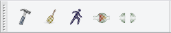

   \– Выбор языка программного модуля

В случае выбора добавления типа данных, появится диалог (см. :numref:`image27`), в
котором необходимо указать механизм создания нового типа данных

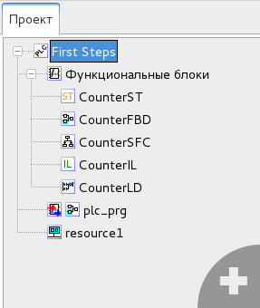

   \– Добавление пользовательского типа данных

Добавление нескольких элементов одного типа, например нескольких
программ, функций, функциональных блоков приводит к их группировке в
дереве проекта. Еще одним способом добавления нового элемента
является нажатие правой клавиши мыши по определённому разделу в
дереве проекта. Например, при нажатии на «Функциональные блоки»,
появится всплывающее меню (см. :numref:`image28`). В данном меню можно выбрать
«Добавить программный модуль» или «Вставить программный модуль», если
он был скопирован в буфер обмена.

Добавление нового элемента или выбор существующего в дереве проекта
приводит к появлению панели редактирования и настроек соответствующего
элемента:

-  Панель настроек проекта;

-  Панель, содержащая текстовый редактор языков ST и IL;

-  Панель, содержащая графические редакторы диаграмм языков FBD, SFC,
   LD;

-  Панель настроек ресурса;

-  Панель редактирование типа данных;

-  Панели настроек плагинов модулей УСО.

Каждая вышеперечисленная панель редактирования будет рассмотрена в
последующих пунктах. 

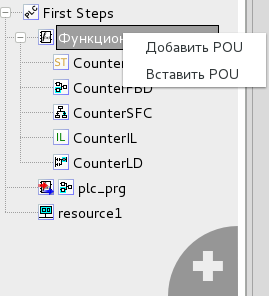

   \– Всплывающее меню добавления и вставки программного модуля

Удаление элемента в дереве проекта

Удаление осуществляется наведением на определённый элемент в дереве
проекта и нажатием на него правой клавишей мыши, а далее в появившемся
меню выбирается пункт «Удалить» (см. :numref:`image29`)

.. figure:: ./media/image29.png
   :name: image29
   :align: center
   :figclass: align-center
   :width: 2.78125in
   :height: 1.35417in

   \– Удаление элемента

Переименование, копирование и вставка программных модулей

Дерево проекта позволяет выполнять операции переименования, копирования
и вставки для программных модулей. Копирование или переименование
осуществляются с помощью нажатия правой клавиши мыши на элемент (см.
:numref:`img29`), соответствующий программному модулю в дереве проекта, и выбор
соответствующего пункта появившегося меню.

.. figure:: ./media/image29.png
   :name: img29
   :align: center
   :figclass: align-center
   :width: 2.77083in
   :height: 1.35417in

   \– Копирование и переименование элемента

Вставка программного модуля осуществляется в меню (нажатие правой
клавишей мыши по данному элементу) корневого элемента дерева проекта,
соответствующего проекту (см. :numref:`image30`):

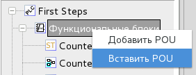

   \– Вставка программного модуля

Другим способом выполнения вышеописанной операции является вызов меню
для элемента группировки программных модулей одного типа (см. :numref:`image31`).

Далее приводится описание панели переменных и констант, которая
присутствует при редактировании проекта, ресурса и программных модулей
(функции, функционального блока, программы).

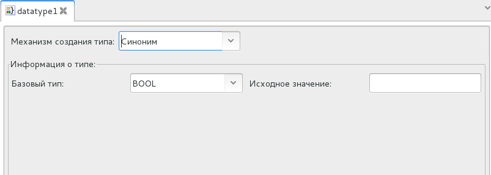

   \– Вставка программного модуля

Панель списка переменных и констант
-----------------------------------

Панель списка переменных и констант (см. :numref:`image32`) отображает с помощью
таблицы переменные и константы, соответствующие выбранному программному
модулю, ресурсу или в целом проекту.

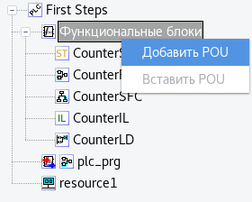

   \– Панель переменных и констант

Каждая переменная имеет следующие параметры:

-  Имя, представляющее собой уникальный идентификатор переменной в
   пределах её области видимости и действия;

-  Класс: «Глобальный», «Вход», «Выход», «Вход/Выход», «Локальный»,
   «Внешний», «Временный»;

-  Тип, определяющий тип переменной и может принадлежать базовому типу
   (в соответствии со стандартом IEC 61131-3), пользовательскому типу
   (псевдониму и поддиапазону существующего типа, перечислению, массиву,
   структуре) или типу функционального блока (стандартному или
   пользовательскому);

-  Размещение - идентификатор, необходимый для связывания данной
   переменной с переменной плагина модуля УСО;

-  Исходное значение значение - инициализация переменной некоторым
   начальным значением;

-  Настройка - задание константности, реманентности (сохранение её
   значения в энергонезависимой памяти) и нереманентности переменной;

-  Описание - комментарий к назначению данной переменной или константы.

Первый символ имени переменной или константы должен быть буквой, или
символом подчеркивания, далее могут следовать цифры, буквы латинского
алфавита и символы подчеркивания. Набор возможных вариантов классов
переменных зависит от типа элемента проекта, редактирования которого
осуществляется. Двойной клик на полю «Размещение» вызывает появление
кнопки «...», показанной на :numref:`image33`:

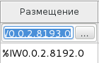

   \- Поле «Размещение» панели переменных и констант

Нажатие на данную кнопку приводит к появлению диалога «Просмотр
директорий» (см. :numref:`image34`), т.е. списка переменных модулей УСО, которые
могут быть связанны с переменой в панели переменных и констант. При
выборе в данном диалоге определённой переменной и нажатии клавиши «OK» в
поле «Адрес» будет добавлен адрес переменной внешнего модуля УСО.

.. figure:: ./media/image34.png
   :name: image34
   :align: center
   :figclass: align-center
   :width: 4.79306in
   :height: 3.0625in

   \- Диалог «Просмотр адресов», вызываемый из поля «Адрес»

Поле опции позволяет определить переменную как константу.
Соответственно, если компилятор обнаружит в коде фрагмент, в котором
происходит изменение этой переменной - будет выведена ошибка компиляции
«Assignment to constant variables is not be allowed» в «Отладочной
консоли». Квалификатор «Константа» не может быть использован в
объявлении функциональных блоков. Добавление, удаление и перемещение
переменных происходит с помощью специальных кнопок на панели переменных
и констант. Описания данных кнопок представлены в таблице 3.

Панель переменных и констант предоставляет возможность фильтровать
отображаемые переменные по их конкретным классам («Вход» ,«Выход»,
«Вход/Выход»,

«Внешний», «Локальный», «Временный») или сгруппированным классам
(«Интерфейс» и «Переменные»). Данная операция выполняется с помощью
функции «Фильтр класса» (см. :numref:`image35`).

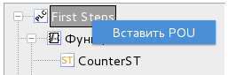

   \- Фильтрация отображения переменных в панели переменных и констант

Таблица 3 - Кнопки добавления, удаление и перемещения переменных на
панели переменных и констант

+-----------------------+-----------------------+-----------------------+
| Внешний вид кнопки    | Название кнопки       | Функция кнопки        |
+=======================+=======================+=======================+
| |image38|             | Добавить переменную   | Добавить новую        |
|                       |                       | переменную в панель   |
|                       |                       | переменных и констант |
|                       |                       | со значениями по      |
|                       |                       | умолчанию             |
+-----------------------+-----------------------+-----------------------+
| |image39|             | Удалить переменную    | Удалить выделенную    |
|                       |                       | переменную или        |
|                       |                       | константу             |
+-----------------------+-----------------------+-----------------------+
| |image40|             | Переместить           | Перемещение           |
|                       | переменную вверх      | переменной в таблице  |
|                       |                       | переменных и констант |
|                       |                       | вверх на одну позицию |
+-----------------------+-----------------------+-----------------------+
| |image41|             | Переместить           | Перемещение           |
|                       | переменную вниз       | переменной в таблице  |
|                       |                       | переменных и констант |
|                       |                       | вниз на одну позицию  |
+-----------------------+-----------------------+-----------------------+

Панель настройки проекта
------------------------

Панель редактирования проекта (см. :numref:`image40`) состоит из панели переменных
и констант, а также настроек сборки проекта и данных о проекте.

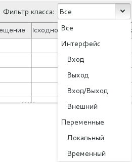

   \- Панели настройки проекта

Настройки сборки проекта (см. :numref:`image41`) позволяют задать следующие
параметры:

-  «URI системы исполнения» - унифицированный (единообразный)
   идентификатор ресурса, в данном случае под ресурсом понимается
   целевое устройство. Данный адрес необходим для режима отладки.

-  «Запретить расширения» - установка данного флага позволяет не
   учитывать при сборке проекта внешние плагины;

-  «Библиотеки» - подключаемые дополнительные библиотеки:
   «Native_Library», «Python_Library», «SVGUI_Library»;

-  «Целевая платформа» - выбор из списка компилятора для архитектуры
   целевого устройства;

-  «Компилятор» - имя исполняемого файла компилятора (если он определён
   в глобальных переменных среды), либо полный путь к нему;

-  «CFLAGS» - указание флагов С компилятора;

-  «Линковщик» - имя исполняемого файла компоновщика (если он определён
   в глобальных переменных среды), либо полный путь к нему;

-  «LDFLAGS» - указание флагов компоновщика;

.. figure:: ./media/image41.png
   :name: image41
   :align: center
   :figclass: align-center
   :width: 3.37986in
   :height: 3.07847in

   \- Панель с настройками проекта

Также в настройках сборки проекта имеются две кнопки, описание которых
приведено в таблице 4.

Таблица 4 - Кнопки в панели настройки сборки проекта

+-----------------------+-----------------------+-----------------------+
| Внешний вид кнопки    | Название кнопки       | Функция кнопки        |
+=======================+=======================+=======================+
| |image44|             | МЭК - код             | Вызов «Панели         |
|                       |                       | отображения           |
|                       |                       | промежуточного кода»  |
|                       |                       | (см. п. 5.5.1), для   |
|                       |                       | вывода кода, из       |
|                       |                       | которого генерируется |
|                       |                       | ST код всего проекта  |
+-----------------------+-----------------------+-----------------------+
| |image45|             | Файлы проекта         | Вызов «Панели файлов  |
|                       |                       | проекта», в которой   |
|                       |                       | можно выбрать файлы   |
|                       |                       | необходимые для       |
|                       |                       | передачи на целевое   |
|                       |                       | устройство вместе с   |
|                       |                       | исполняемым файлом    |
|                       |                       | (см. п. 5.5.2)        |
+-----------------------+-----------------------+-----------------------+

Вкладка «Проект» (см. :numref:`image44`) позволяет задать: имя проекта, версию
проекта, имя продукта, версию продукта и релиз продукта.

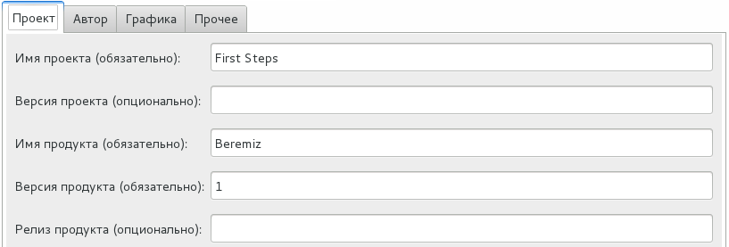

   \– Вкладка с данными проекта

Вкладка «Автор» (см. :numref:`image45`) позволяет задать: Имя компании, URL-адрес
компании, Имя автора, Название организации.

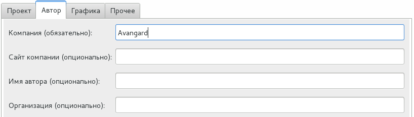

   \– Вкладка данные об авторе проекта

Вкладка «Графика» (см. :numref:`image46`) позволяет задать размеры страницы и
разрешение сетки для редакторов диаграмм графических языков FBD, LD и
SFC.

.. figure:: ./media/image46.png
   :name: image46
   :align: center
   :figclass: align-center
   :width: 6.31944in
   :height: 2.37431in

   \– Вкладка графика

Вкладка «Прочее», изображенная на :numref:`image47`, позволяет выбрать язык
интерфейса для среды разработки Beremiz и указать дополнительное
текстовое описание для проекта.

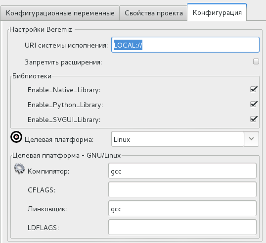

   \– Вкладка с настройками языка и описанием проекта

При запуске среды разработки Beremiz языком по умолчанию является язык,
соответствующий текущей локали операционной системы, если файл для
данной локали присутствуют. В случае отсутствия данных файлов,
устанавливается английская локаль, которая доступна всегда. Файлы
доступных локалей располагаются в папке beremiz/locale.

Панель отображения промежуточного кода

Данная панель (см. :numref:`image48`) представляет собой текстовый редактор,
отображающий с подсветкой синтаксиса и нумерацией строк код на языке ST,
доступный только для чтения, без возможности редактирования.

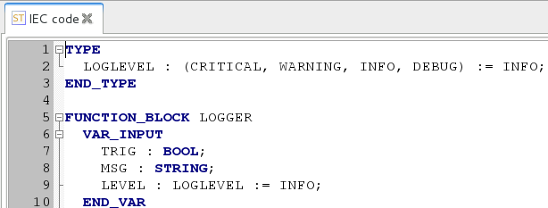

   \– Панель отображения промежуточного кода на языке ST

Открытие данной панели доступно после сборки проекта с помощью
соответствующей кнопки (см. таблицу 2).

Панель файлов проекта

Панель файлов проекта (см. :numref:`image49`) содержит встроенный проводник файлов
(справа), в котором файлы могут быть выделены и перенесены в левую
часть.

.. figure:: ./media/image49.png
   :name: image49
   :align: center
   :figclass: align-center
   :width: 6.20834in
   :height: 2.97826in

   \– Вкладка файлы проекта

Все манипуляции с файлами осуществляются с помощью кнопок, расположенных
в середине данной панели. Их описание приведено в таблице 5.

Таблица 5 - Кнопки в панели файлов проекта

+-----------------------+-----------------------+-----------------------+
| Внешний вид кнопки    | Название кнопки       | Функция кнопки        |
+=======================+=======================+=======================+
| |image39|             | Удалить файл из левой | Удаление выделенного  |
|                       | директории            | файла из левого       |
|                       |                       | списка добавленных    |
|                       |                       | файлов в проект       |
+-----------------------+-----------------------+-----------------------+
| |image52|             | Скопировать файл из   | Добавить выделенный   |
|                       | правой директории в   | файл из проводника    |
|                       | левую                 | файлов в проект       |
+-----------------------+-----------------------+-----------------------+
| |image53|             | Скопировать файл из   | Добавить в текущую    |
|                       | левой директории в    | папку проводника      |
|                       | правую                | файлов слева          |
|                       |                       | выделенный файл в     |
|                       |                       | списке файлов проекта |
+-----------------------+-----------------------+-----------------------+

Данные файлы будут переданы на целевое устройство вместе с исполняемым
файлом. Как правило, этими дополнительными файлами проекта являются
сторонние библиотеки, необходимые для корректной работы плагинов модулей
УСО.

Текстовый редактор языков ST и IL
---------------------------------

Текстовый редактор языков ST и IL (см. :numref:`image52`) позволяет создавать и
редактировать алгоритмы и логику выполнения программных модулей на
языках ST и IL.

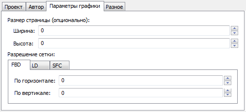

   \– Текстовый редактор языков ST и IL

Он обеспечивают следующие возможности:

-  Подсветку синтаксиса кода, написанного пользователем, т.е. выделения
   особыми параметрами шрифта ключевых слов данных языков;

-  Нумерации строк, что может быть полезным при возникновении ошибок в
   программе, т.к. транслятор кода ST в C выдаёт номер строки, в которой
   найдена ошибка;

-  Сворачивание кода структурных элементов языка: определения функции,
   определение типа и т. Д.

Увеличение или уменьшение размера шрифт выполняется с помощью Ctrl +
<колёсико мыши>.

Описание синтаксиса, основных конструкций и примеров использования языков
ST и IL приведены в описании языков стандарта МЭК 61131-3.

Графические редакторы диаграмм языков FBD, SFC, LD
--------------------------------------------------

Данные редакторы позволяют создавать и редактировать алгоритмы и логику
выполнения программных модулей, написанных на языках FBD, SFC и LD.

Редактор языка FBD

Основными элементами языка FBD являются: переменные, функциональные
блоки и соединения. При редактировании FBD диаграммы, в панели
инструментов появляется следующая панель (см. :numref:`image53`).

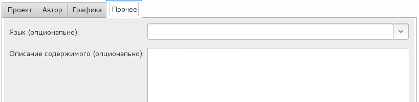

   \– Панель редактирования FBD диаграмм

С помощью данной панели можно добавить все элементы языка FBD
(назначение каждой кнопки описано в таблице 6).

Таблица 6 - Кнопки в панели файлов проекта

+-----------------------+-----------------------+-----------------------+
| Внешний вид кнопки    | Название кнопки       | Функция кнопки        |
+=======================+=======================+=======================+
| |image56|             | Выделение объектов на | Перевод указателя     |
|                       | диаграмме             | мыши в состояние, при |
|                       |                       | котором можно         |
|                       |                       | осуществлять          |
|                       |                       | выделение объектов    |
|                       |                       | редакторе одного из   |
|                       |                       | графических языков    |
+-----------------------+-----------------------+-----------------------+
| |image57|             | Перемещение           | Перевод указателя     |
|                       |                       | мыши в состояние, при |
|                       | диаграммы             | котором можно         |
|                       |                       | изменять размеры      |
|                       |                       | редактора одного из   |
|                       |                       | графических языков, с |
|                       |                       | помощью его           |
|                       |                       | перемещения           |
+-----------------------+-----------------------+-----------------------+
| |image58|             | Создать новый         | Вызов диалога         |
|                       | комментарий           | создания комментария  |
|                       |                       |                       |
+-----------------------+-----------------------+-----------------------+
| |image59|             | Добавить переменную   | Вызов диалога         |
|                       |                       | добавления переменной |
|                       |                       |                       |
+-----------------------+-----------------------+-----------------------+
| |image60|             | Добавить              | Вызов диалога         |
|                       |                       | добавления            |
|                       | функциональный блок   | функционального блока |
+-----------------------+-----------------------+-----------------------+
| |image61|             | Добавить подключение  | Вызов диалога         |
|                       |                       | добавления соединения |
|                       |                       |                       |
+-----------------------+-----------------------+-----------------------+

Для этого необходимо указателем мыши выбрать необходимую кнопку и нажать
на свободное место в области редактирования FBD диаграммы. В зависимости
от выбранного элемента появятся определённые диалоги добавления данного
элемента.

Аналогичные действия можно выполнить с помощью всплывающего меню в
области редактирования FBD диаграмм. Вызов данного меню происходит
нажатием правой клавишей мыши и выбором пункта «Добавить», в котором
будет: «Блок», «Переменная», «Подключение», «Комментарий» (см. :numref:`image60`).

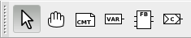

   \- Всплывающее меню редактора языка FBD

Далее рассмотрено добавление каждого элемента в отдельности.

Добавление функционального блока

При добавлении функционального блока одним из описанных выше способов,
появится диалог «Свойства блока» (см. :numref:`image61`).

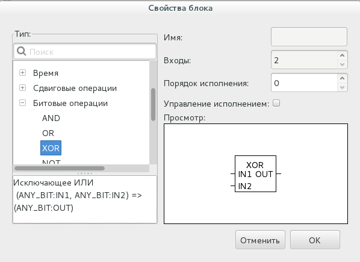

   \– Свойства функционального блока

В данном диалоге приведено краткое описание функционального блока и
предоставлена возможность задать некоторые свойства (имя, количество
входов, порядок выполнения и т.д.).

Опция «Управление исполнением» добавляет в функциональный блок
дополнительные параметры EN/ENO, о которых подробнее рассказано в
приложении 5. Для сохранения изменений необходимо нажать «OK». Одним из
свойств является «Порядок исполнения».

Добавление (путем копирования существующего блока), удаление и
переименование функционального блока осуществляется при помощи команд
меню «Редактирование» в главном меню или с помощью всплывающего меню
диаграммы (см. :numref:`image61`).

Следует отметить, что функциональный блок может быть так же добавлен из
«Панели библиотеки функций и функциональных блоков»,
перетаскиванием мыши (Drag&Drop) выбранного блока на панель
редактирования диаграммы FBD.

Добавление переменной

Переменные добавляются из панели переменных и констант с помощью
перетаскивания (Drag&Drop) левой клавишей мыши за область, выделенную
красным цветом на :numref:`image62`, в область редактирования FBD диаграмм.

.. figure:: ./media/image62.png
   :name: image62
   :align: center
   :figclass: align-center
   :width: 6.77639in
   :height: 2.9125in

   \– Добавление переменной из панели переменных и констант

Изменить параметры переменной можно в диалоге «Свойства переменной» (см.
:numref:`image63`), нажав на неё два раза левой клавишей мыши.

.. figure:: ./media/image63.png
   :name: image63
   :align: center
   :figclass: align-center
   :width: 3.02083in
   :height: 2.75486in

   \– Свойства переменной

В данном диалоге можно задать порядок исполнения переменной и изменить
её класс («Вход», «Выход», «Вход/Выход»).

Добавление подключения

В тех случаях, когда необходимо передать выходное значение одного
функционального блока на один из входов другого, удобно использовать
элемент «Подключение». При прямом соединении с помощью перетаскивания
выхода одного функционального блока к входу другого получится прямое
соединение с помощью чёрной соединительной линии. На схемах с большим
количеством функциональных блоков элемент «Подключение» позволяет
избежать пересечения прямых соединений, которые приводит к тому, что
схема становится менее понятной.

После выбора добавления элемента «Подключение» появится диалог «Свойства
подключения» (см. :numref:`image64`).

.. figure:: ./media/image64.png
   :name: image64
   :align: center
   :figclass: align-center
   :width: 2.79525in
   :height: 1.88235in

   \- Диалог добавления подключения для FBD

В данном диалоге можно выбрать тип соединения: «Выходное соединение» -
для выходного значения, «Входное соединение» - для входного значения, а
так же необходимо указать имя данного соединения. На :numref:`image65` представлен
пример использования соединений.

.. figure:: ./media/image65.png
   :name: image65
   :align: center
   :figclass: align-center
   :width: 4.11667in
   :height: 1.57708in

   \- Пример FBD диаграммы с использованием подключений

Функция «MAX» на выходе «OUT» имеет некоторое значение, которое с
помощью соединения «RESULT» передаётся на вход «IN1» в функцию «MIN». В
функции «MAX» используется соединение типа «Выходное соединение», в
функции «MIN» - типа «Входное соединение». Имена у этих соединений,
соответственно, одинаковые.

Добавление комментариев

Редактор FBD диаграмм (и остальные редакторы, о которых будет рассказано
ниже) позволяют добавлять комментарии на диаграмму. После выбора на
панели редактирования комментария и добавления его в область
редактирования появится диалог (см. :numref:`image66`) для ввода текста
комментария.

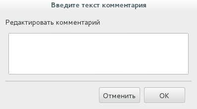

   \– Диалог добавления комментария

После нажатия кнопки «ОК» комментарий появится на диаграмме(см. :numref:`image67`)

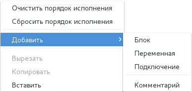

   \– Добавленный комментарий к FBD диаграмме

Порядок выполнения функций и функциональных блоков

Последовательность исполнения функций и функциональных блоков
определяется порядком их выполнения. Автоматически он регламентируется
следующим образом: чем выше и левее расположен верхний левый угол,
описывающего функцию или функциональный блок прямоугольника, тем раньше
данная функция или функциональный будет выполнен.

Если обратиться к :numref:`image68`, то порядок выполнения функций будет
следующим: 1 – CounterST0; 2 – CounterFBD0; 3 – CounterSFC0.

.. figure:: ./media/image68.png
   :name: image68
   :align: center
   :figclass: align-center
   :width: 5.60875in
   :height: 1.55208in

   \- Схема, содержащая функции с порядком выполнения (обсчета) по расположению

Данная опция «Порядок выполнения» выделена красным цветом на :numref:`image69`.

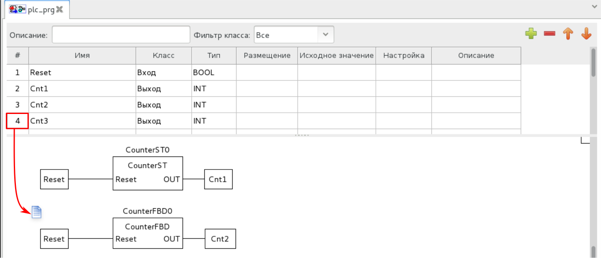

   \- Свойство порядок выполнения функции или функционального блока

После задания порядка выполнения для каждой функции или функционального
блока на схеме в правом нижнем углу будет указан его порядковый номер
выполнения. Пример представлен на :numref:`image70`.

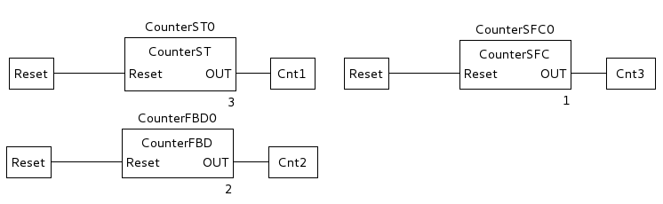

   \- Схема, содержащая функции с порядком выполнения заданным вручную

Описание языка FBD, основных его конструкций и пример использования
приведены в приложении 5.

Редактор языка LD

Язык LD или РКС (Релейно-Контактные Схемы) представляет собой
графическую форму записи логических выражений в виде контактов и катушек
реле. Основными элементами языка LD являются: шина питания, катушка,
контакт. Добавить данные элементы, так же как и элементы языка FBD,
можно несколькими способами.

Как только активной становится вкладка с редактированием LD диаграммы, в
панели инструментов появляется панель (см. :numref:`image71`) с элементами языка
LD.

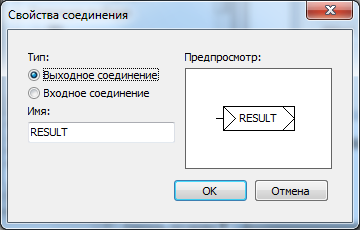

   \- Панель редактирования LD диаграмм

Аналогично редактору языка FBD с помощью данной панели можно добавить
все элементы языка LD, а так же и FBD, т.к. есть возможность
комбинированного применения языков на одной диаграмме. В таблице 7
приведено описание кнопок данной панели. Описание остальных кнопок,
относящихся к языку FBD, находится в таблице 6.

Таблица 7 - Кнопки панели редактирования LD диаграммы

+-----------------------+-----------------------+-----------------------+
| Внешний вид кнопки    | Название кнопки       | Функция кнопки        |
+=======================+=======================+=======================+
| |image74|             | Создать новую шину    | Вызов диалога         |
|                       | питания               | создания новой шины   |
|                       |                       | питания               |
+-----------------------+-----------------------+-----------------------+
| |image75|             | Создать новую катушку | Вызов диалога         |
|                       |                       | создания новой        |
|                       |                       | катушки               |
+-----------------------+-----------------------+-----------------------+
| |image76|             | Создать новый контакт | Вызов диалога         |
|                       |                       | создания нового       |
|                       |                       | контакта              |
+-----------------------+-----------------------+-----------------------+

Во всплывающем меню для редактора LD диаграмм (см. :numref:`image75`), так же как
и в панели инструментов помимо элементов LD языка, доступны элементы
языка FBD.

.. figure:: ./media/image75.png
   :name: image75
   :align: center
   :figclass: align-center
   :width: 2.51667in
   :height: 1.92153in

   \- Всплывающее меню редактора языка LD

Добавление шины питания

При добавлении шины питания, одним из описанных выше способов, появится
диалог «Свойства шины питания» (см. :numref:`image76`).

В данном диалоге указываются следующие свойства:

-  Тип шины питания: шина питания слева или шина питания справа;

-  Количество контактов на добавляемой шине питания.

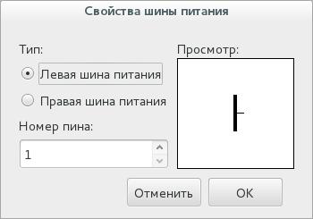

   \- Свойство шины питания

На :numref:`image77` приведены две добавленные шины питания: левая с тремя
контактами и правая с одним контактом.

.. figure:: ./media/image77.png
   :name: image77
   :align: center
   :figclass: align-center
   :width: 1.36275in
   :height: 1.4875in

   \- Шины питания на LD диаграмме

Добавление контакта

При добавлении контакта на LD диаграмму появится диалог «Редактирование
значения контакта» (см. :numref:`image78`).

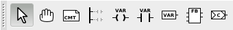

   \- Редактирование контакта

Данный диалог позволяет определить модификатор данного контакта:

-  «Обычный»;

-  «Инверсия»;

-  «Нарастающий фронт»;

-  «Спадающий фронт».

Кроме того, диалог позволяет выбрать из списка «Имя» переменную,
«связываемую» с данным контактом. Следует отметить, что «связываемые»
переменные должны быть определены в панели переменных и констант для
данного программного модуля типом BOOL.

Еще одним способом добавления контакта на диаграмму является метод
Drag&Drop из панели переменных и констант переменной типа BOOL и класса:
«Вход»,

«Вход/Выход», «Внешний», «Локальный», «Временный». Для этого необходимо
зажать левой кнопкой мыши за первый столбец (который имеет заголовок #)
переменную, удовлетворяющую описанным выше критериям и перенести в
область редактирования диаграммы (см. :numref:`image79`).

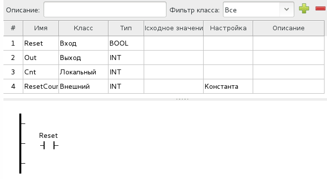

   \- Добавление контакт на диаграмму из панели переменных и констант

Добавление катушки

При добавлении катушки на LD диаграмму появится диалог «Редактирование
значения катушки» (см. :numref:`image80`).

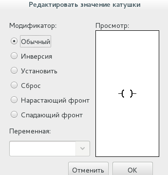

   \– Редактирование катушки

В данном диалоге можно определить модификатор данного контакта:

-  «Обычный»;

-  «Инверсия»;

-  «Установить»;

-  «Сброс»;

-  «Нарастающий фронт»;

-  «Спадающий фронт».

Кроме того, производится выбор из списка «Имя» переменной, «связываемой»
с данным контактом. Эти переменные, как и для контактов, должны быть
определены в панели переменных и констант для данного программного
модуля типом BOOL.

Аналогично добавлению контакта с помощью Drag&Drop можно добавить и
катушки, но в данном случае переменная должна относиться к классу
«Выход» (см. :numref:`image81`).

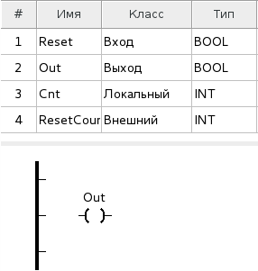

   \- Добавление катушки на диаграмму из панели переменных и констант

Описание языка LD, основных конструкций и примера его использования
приведены в описании яызков стандарта МЭК 61131-3.

Редактор языка SFC

Основными элементами языка SFC являются: начальный шаг, шаг, переход,
блок действий, дивергенции, «прыжок». Программа на языке SFC состоит из
набора шагов, связанных переходами.

Как только активной становится вкладка с редактированием SFC диаграммы,
в панели инструментов появляется следующая панель (см. :numref:`image82`).

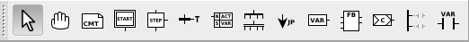

   \- Панель редактирования SFC диаграмм

В таблице 8 приведено описание кнопок данной панели. Описание остальных
кнопок, относящихся к языку FBD и LD (за исключением катушки) и так же
находящихся на этой панели, приведены в таблицах 6 и 7 соответственно.

Таблица 8 - Кнопки панели редактирования LD диаграммы

+-----------------------+-----------------------+-----------------------+
| Внешний вид кнопки    | Название кнопки       | Функция кнопки        |
+=======================+=======================+=======================+
| |image85|             | Создать новый         | Вызов диалога         |
|                       | начальный шаг         | редактирования шага   |
|                       |                       |                       |
+-----------------------+-----------------------+-----------------------+
| |image86|             | Создать новый шаг     | Вызов диалога         |
|                       |                       | редактирования шага   |
+-----------------------+-----------------------+-----------------------+
| |image87|             | Создать новый переход | Вызов диалога         |
|                       |                       | редактирования        |
|                       |                       | перехода              |
+-----------------------+-----------------------+-----------------------+
| |image88|             | Создать новый блок    | Вызов диалога         |
|                       | действий              | редактирования блока  |
|                       |                       | действий              |
+-----------------------+-----------------------+-----------------------+
| |image89|             | Создать новое         | Вызов диалога         |
|                       | ветвление             | создания новой        |
|                       |                       | дивергенции и         |
|                       |                       | конвергенции          |
+-----------------------+-----------------------+-----------------------+
| |image90|             | Создать новый         | Вызов диалога         |
|                       | безусловный переход   | создания «прыжка»     |
+-----------------------+-----------------------+-----------------------+

Далее даётся описание добавления приведённых в таблице 8 элементов языка
SFC.

Добавление шага инициализации и шага

Процедура добавления шага инициализации и обычного шага ничем не
отличается. В обоих случаях вызывается диалог «Редактировать шаг» (см.
:numref:`image89`).

.. figure:: ./media/image90.png
   :name: image90
   :align: center
   :figclass: align-center
   :width: 2.91111in
   :height: 1.92917in

   \- Диалог редактирования шага инициализации SFC диаграммы

Согласно стандарту IEC 61131-3, на SFC диаграмме должен быть один шаг
инициализации, который характеризует начальное состояние SFC-диаграммы и
отображается со сдвоенными линиями на границах (см. :numref:`image91`).

.. figure:: ./media/image91.png
   :name: image91
   :align: center
   :figclass: align-center
   :width: 0.85429in
   :height: 0.6876in

   \- Шаг инициализации языка SFC

В случае, если при добавлении шага не указано его имя - будет выдана
ошибка (см. :numref:`image92`).

.. figure:: ./media/image92.png
   :name: image92
   :align: center
   :figclass: align-center
   :width: 3.12544in
   :height: 1.58355in

   \– Ошибка отсутствия имени шага при его добавлении в диаграмму

При добавлении шага появляется диалог, в котором можно указать, с
помощью галочек его соединители (см. :numref:`image89`):

-  «Вход»;

-  «Выход»;

-  «Действие».

.. figure:: ./media/image89.png
   :name: image89
   :align: center
   :figclass: align-center
   :width: 2.91111in
   :height: 1.92917in

   \– Добавление шага SFC на диаграмму

«Действие» добавляет соединитель для связывания данного шага с блоком
действий. «Вход» и «Выход» соединители, как правило, соединены с
переходом. Соответственно, после нажатия кнопки OK, на диаграмму будет
добавлен шаг с указанными соединителями (см. :numref:`image93`).

.. figure:: ./media/image93.png
   :name: image93
   :align: center
   :figclass: align-center
   :width: 0.77394in
   :height: 0.54862in

   \- Шаг SFC диаграммы с соединителями входа и действия

Добавление перехода

При добавлении на SFC диаграмму перехода, появится диалог «Редактировать
переход» (см. :numref:`image94`).

.. figure:: ./media/image94.png
   :name: image94
   :align: center
   :figclass: align-center
   :width: 2.66597in
   :height: 2.53125in

   \– Добавление нового перехода в диаграмму

В данном диалоге необходимо выбрать тип перехода и его приоритет. Тип
перехода может быть:

-  «Ссылка»;

-  «Встроенный код»;

-  «Соединение».

При выборе типа перехода «Ссылка» в открывающемся списке (см. :numref:`image95`)
будут доступны переходы, предопределённые в дереве проекта для данного
программного модуля, написанного на языке SFC. Добавление
предопределённого перехода описывается ниже после описания всех
добавляемых элементов языка SFC.

.. figure:: ./media/image95.png
   :name: image95
   :align: center
   :figclass: align-center
   :width: 2.71865in
   :height: 2.57843in

   \- Всплывающий список с доступными предопределёнными переходами

При выборе типа перехода «Непосредственно» (см. :numref:`image96`), условие
перехода можно написать в виде выражения на языке ST.

.. figure:: ./media/image96.png
   :name: image96
   :align: center
   :figclass: align-center
   :width: 2.65625in
   :height: 2.54097in

   \- Условие перехода в виде встроенного кода, написанного на языке ST

Реализация перехода таким способом удобна в случае, когда необходимо
короткое условие, например: переменные «F3» и «F4» типа INT равны.
Встроенный код для такого условия выглядит следующим образом (см. :numref:`image96`):

F3 = F4

Так же например можно в качестве условия просто указать переменную. В
случае её значения равного 0 - будет означать FALSE, все остальные
значения - TRUE.

При выборе типа перехода «Соединение» (см. :numref:`image97`), в качестве условия
перехода можно использовать выходные значения элементов языка FBD или
LD.

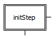

   \- Выбор условия перехода как соединение с элементами других графических языков IEC 61131-3

При выборе типа перехода «Подключение», у добавленного перехода появится
слева контакт, который необходимо соединить с выходным значением,
например, функционального блока языка FBD или катушки LD диаграммы.
Стоит отметить, что данное выходное значение должно быть типа BOOL.
Ниже, на :numref:`image98` красным цветом выделен пример перехода, условия
которого задано с помощью языка LD.

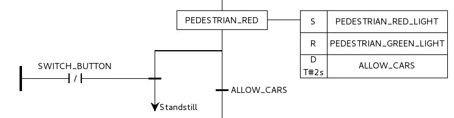

   \– Пример SFC диаграммы, в которой один из переходов задан с помощью языка LD

Добавление блока действий

При добавлении блока действий на диаграмму появится диалог
«Редактировать свойство блока действий» (см. :numref:`image99`).

.. figure:: ./media/image99.png
   :name: image99
   :align: center
   :figclass: align-center
   :width: 3.70588in
   :height: 2.11019in

   \- Диалог «Редактировать свойство блока действий»

Данный блок действий может содержать набор действий. Добавить новое
действие можно нажав кнопку «Добавить» и установив необходимые
параметры:

-  «Спецификатор»;

-  «Длительность»;

-  «Тип»: «Действие», «Переменная», «Непосредственно»;

-  «Значение»;

-  «Индикатор».

Поле «Спецификатор» определяет момент времени, когда действие
начинается, сколько времени продолжается и когда заканчивается. Выбрать
квалификатор можно из списка (см. :numref:`image100`).

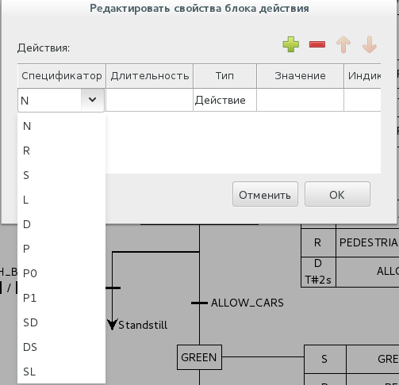

   \- Меню выбора спецификатора для действия в диаграмме SFC

Подробное описание спецификаторов, которые выбираются из предлагаемого
списка при добавлении действия приведено в таблице 9.

Таблица 9 - Квалификаторы действий SFC диаграммы

+-----------------------------------+-----------------------------------+
| Имя спецификатора                 | Поведение блока действия          |
+===================================+===================================+
| D                                 | Действие начинает выполняться     |
|                                   | через некоторое заданное время    |
|                                   | (если шаг еще активен) и          |
|                                   | выполняется до тех пор, пока      |
|                                   | данный шаг активен                |
+-----------------------------------+-----------------------------------+
| L                                 | Действие выполняется в течение    |
|                                   | некоторого заданного интервала    |
|                                   | времени, после чего выполнение    |
|                                   | действия останавливается          |
+-----------------------------------+-----------------------------------+
| N                                 | Действие выполняется, пока данный |
|                                   | шаг активен                       |
+-----------------------------------+-----------------------------------+
| P                                 | Действие выполняется один раз,    |
|                                   | как только шаг стал активен       |
+-----------------------------------+-----------------------------------+
| P0                                | Действие выполняется один раз,    |
|                                   | как только шаг стал неактивен     |
+-----------------------------------+-----------------------------------+
| P1                                | Действие выполняется один раз,    |
|                                   | как только шаг стал активен       |
+-----------------------------------+-----------------------------------+
| S                                 | Действие активируется и остается  |
|                                   | активным пока SFC диаграмма       |
|                                   | выполняется                       |
+-----------------------------------+-----------------------------------+
| R                                 | Действие выполняется, когда       |
|                                   | диаграмма деактивизируется        |
+-----------------------------------+-----------------------------------+
| DS                                | Действие начинается выполняться   |
|                                   | через некоторое заданное время,   |
|                                   | только в том случае если шаг еще  |
|                                   | активен                           |
+-----------------------------------+-----------------------------------+
| SL                                | Действие активно в течении        |
|                                   | некоторого, заданного интервала   |
+-----------------------------------+-----------------------------------+
| SD                                | Действие начинается выполняться   |
|                                   | через некоторое время, даже в том |
|                                   | случае если шаг уже не активен    |
+-----------------------------------+-----------------------------------+

Поле «Длительность» необходимо для установки интервала времени
необходимого для некоторых квалификаторов, описанных выше в таблице 9.

«Тип» определяет код или конкретную манипуляцию, которая будет
выполняться во время активации действия. В случае выбора «Действия»
появляется возможность, как и в случае с переходом, использовать
предопределённые действия в дереве проекта для данного программного
модуля, написанного на языке SFC (см. :numref:`image101`).

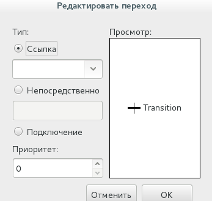

   \- Выбор предопределённого действия

Добавление предопределённого действия также как добавление
предопределённого перехода описывается ниже после описания всех
добавляемых элементов языка SFC.

В случае выбора типа действия «Переменная» в поле «Значение» появляется
возможность выбрать переменные (см. :numref:`image102`), относящиеся к данному
программному модулю.

.. figure:: ./media/image102.png
   :name: image102
   :align: center
   :figclass: align-center
   :width: 3.68611in
   :height: 2.00972in

   \- Выбор предопределённой переменной

Как только шаг становится активным, данная переменная в зависимости от
своего типа принимает значение 0, 0.0, FALSE и другие нулевые значения
типов. Как только действие начинает выполняться, переменная принимает
значение 1, 1.0, TRUE и другие единичные значения типов. В случае если
действие прекратило своё выполнение переменная снова принимает значение
0, 0.0, FALSE и другое нулевое значение, в зависимости от своего типа.

В случае выбора «Непосредственно», появляется возможность в поле
«Значение» написать на языке ST код, который будет выполняться, когда
действие становится активным (см. :numref:`image103`).

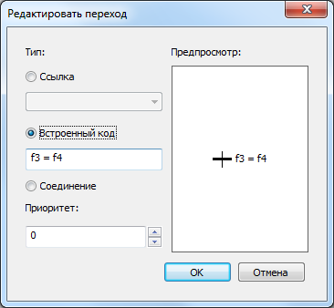

   \- Написание встроенного кода для действия

Следует отметить, что в конце встроенного кода для действия необходимо
поставить «;», в отличие от встроенного кода для перехода.

После добавления блока действия на диаграмму необходимо его
ассоциировать с конкретным шагом. Данная операция выполняется обычным
соединением правого контакта у шага и левого контакта у действия (см.
:numref:`image104`).

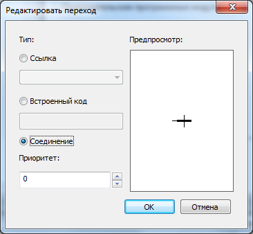

   \- Ассоциирование шага ORANGE блоком действия, содержащим четыре действия

Добавление дивергенции и конвергенции

При добавлении ветвления, появится диалог «Создать новое ветвление» (см.
:numref:`image105`).

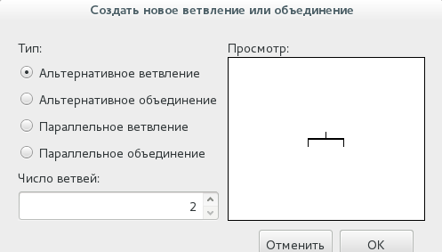

   \– Добавление альтернативного ветвления(дивергенции)

В первую очередь следует выбрать тип ветвления:

-  «Альтернативное ветвление»;

-  «Альтернативное объединения»;

-  «Параллельное ветвление»;

-  «Параллельное объединение».

Вторым параметром является количество разветвлений, которое определяет
на сколько ветвей будет либо расходится (в случае выбора типа
дивергенции «Альтернативное ветвление» или «Параллельное ветвление»)
одна ветвь, либо сколько ветвей будет сходиться в одну ветвь (в случае
выбора типа дивергенции «Альтернативное объединения» или «Параллельное
объединение»)

Пример дивергенции с двумя разветвлениями показан на :numref:`image106` и выделен
красным цветом.

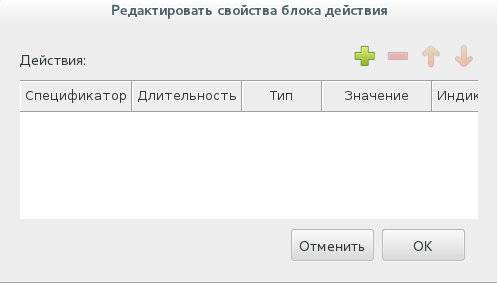

   \– Пример SFC диаграммы, содержащей альтернативное ветвление

Пример конвергенции выделен красным цветом на :numref:`image106_2`.

   \– Пример SFC диаграммы, содержащей альтернативное объединение

Пример параллельного ветвления показан на :numref:`image107` и выделен красным
цветом.

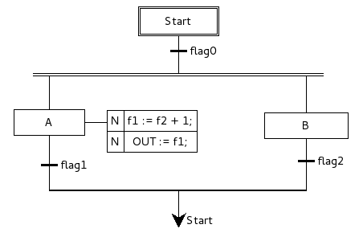

   \– Пример SFC диаграммы с параллельным ветвлением

Согласно стандарту IEC 61131-3, каждая ветвь альтернативного ветвления
должна оканчиваться переходом, при альтернативном объединении переход
должен быть перед каждой ветвью. При параллельном ветвлении переход
должен быть перед ветвлением, а при параллельном объединении переход
необходим после объединения.

Добавление безусловного перехода

Элемент «безусловный переход» на SFC диаграмме подобен выполнению
оператора GOTO при переходе на определённую метку в коде в различных
языках программирования. После выбора добавления «прыжка» на SFC
диаграмму, появится диалог (см. :numref:`image108`), в котором необходимо выбрать
из списка шаг, к которому будет происходить «прыжок» - переход от одного
шага SFC диаграммы к другому.

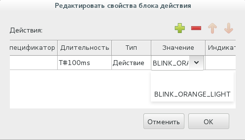

   \– Диалог добавления безусловного перехода

В данном диалоге также присутствует и шаг инициализации (начальный шаг).
После выбора шага и нажатия кнопки OK. На SFC диаграмме появится
стрелочка, которую нужно соединить с переходом (см. :numref:`image109`). Справа от
стрелочки находится имя шага, к которому осуществляется переход в случае
выполнения условия перехода, находящегося выше и соединённого с ней.

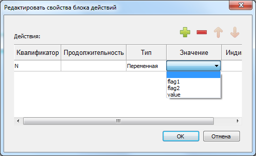

   \– Безусловный переход с шага Stop на начальный шаг Start

Согласно стандарту IEC 61131-3, между шагом и «прыжком» должен
обязательно быть определён переход.

Предопределённые условия перехода и действия в дереве проекта

В случае, если необходимо использовать определённое условие перехода
между множеством шагов, есть возможность определить данное условие
перехода в структуре SFC диаграммы. Данная операция выполняется нажатием
на данную SFC диаграмму на дереве проекта правой клавишей мыши
и выбором «Добавить переход» (см. :numref:`image110`).

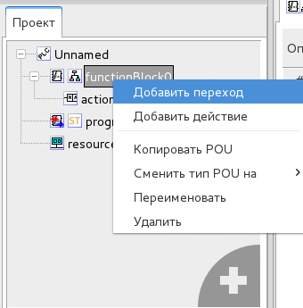

   \- Всплывающее меню SFC диаграммы в панели проекта

Далее появится диалог под названием «Создать новый переход» (см.:numref:`image111`).
В нём необходимо выбрать уникальное имя перехода и язык, в котором
будет описано данное условие.

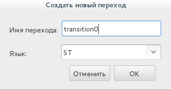

   \- Диалог «Создать новый переход»

В случае, если переходы с введённым именем уже существуют, то будет
выведено сообщение об ошибке (см. :numref:`image112`).

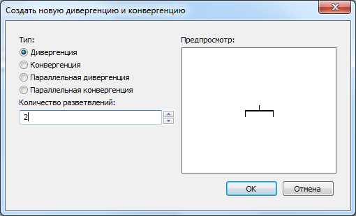

   \- Сообщение об ошибке добавления существующего программного модуля

Добавление действия в структуру SFC диаграммы (см. :numref:`image113`) происходит
аналогично добавлению перехода в данную структуру.

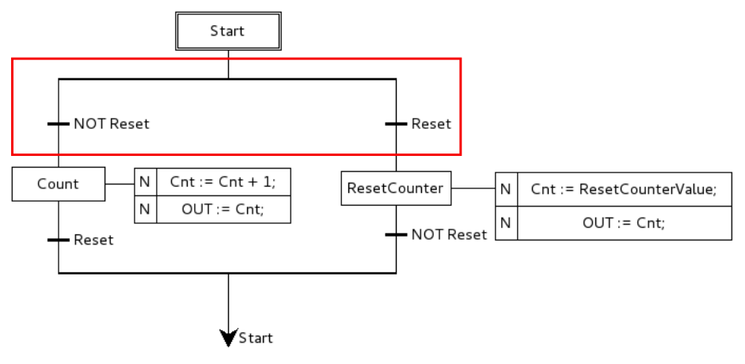

   \- Всплывающее меню SFC для структуры диаграммы

После выбора «Добавить действие» во всплывающем меню, вызванном с
помощью нажатия правой клавиши мыши по программному модулю, написанном с
помощью языка SFC, появится диалог «Создать новое действие» 
(см. :numref:`image114`).

.. figure:: ./media/image114.png
   :name: image114
   :align: center
   :figclass: align-center
   :width: 2.48958in
   :height: 1.42039in

   \- Диалог «Создать новое действие»

В данном диалоге необходимо указать «Имя действия» (должно быть
уникальным) и выбрать язык (ST, IL, FBD, LD), на котором будет написано
данное действие. Если имя действия не заполнено будет выведено сообщение
об ошибке (см. :numref:`image115`).

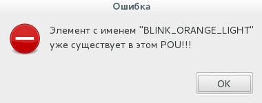

   \- Ошибка не заполнения имени действия при его добавлении

После того как действие добавлено, необходимо реализовать его код на
текстовом или графическом языке, в зависимости от языка, который был
выбран в диалоге «Создать новое действие» (см. :numref:`image114`). После
добавления переходов и действий в дерево проекта они будут доступны для
множественного использования.

Описание языка SFC, основных конструкций и примера его использования
приведены в приложении 7.

Панель редактирования ресурса
-----------------------------

Панель редактирования ресурса (см. :numref:`image116`) содержит панель переменных и
констант, которая позволяет определять глобальные переменные на уровне
ресурса и панели, содержащие задачи и экземпляры.

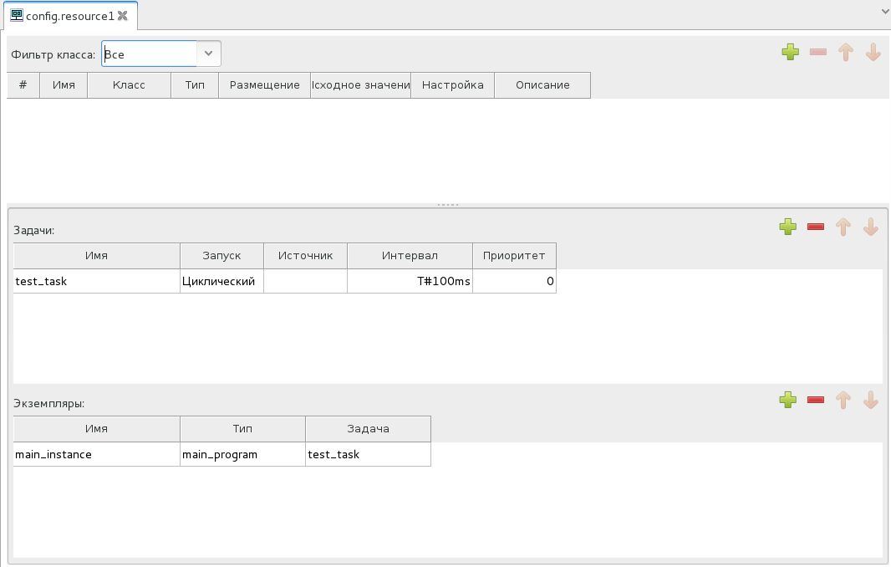

   \- Вкладка ресурс главной рабочей области

Добавление переменных в ресурс ничем не отличается от добавления
переменных в программные модули, единственное исключение - переменные
могут быть только класса «Глобальная». Основной задачей данной панели
является возможность добавить экземпляр, указать для него программный
модуль типа «Программа», из ранее определённых в проекте, для поля «Тип»
и выбрать задачу из добавленных в список «Задачи».

Панель редактирования типа данных
---------------------------------

Панель редактирования типа данных (см. :numref:`image117`) позволяет определить
различные параметры создаваемого пользовательского типа данных.

   \- Вкладка создания нового типа данных

Главным параметром является список под названием «Механизм создания
нового типа», позволяющим выбрать следующие типы:

-  Синоним;

-  Поддиапазон существующего типа (выделение диапазона значений
   стандартного типа);

-  Перечисление (перечисляемый тип);

-  Массив;

-  Структура, позволяющая определять тип, основанный на объединении
   несколько типов.

Далее рассмотрены подробнее параметры для каждого из вышеперечисленных
типов.

Синоним

При выборе «Синоним» (см. :numref:`image118`), из списка указывается базовый тип и
его начальное значение.

   \- Добавление псевдонима типа данных

Созданный тип представляет собой псевдоним (например, аналогично
использованию typedef в языке C) уже существующего типа.

Поддиапазон существующего типа

В случае выбора механизма создания нового типа «Поддиапазон
существующего типа», помимо базового типа и начального значения
производится установка параметров «Минимум» и «Максимум» (см. :numref:`image119`),
т.е. соответственно минимального и максимального значения, которое может
принимать создаваемый тип данных.

.. figure:: ./media/image119.png
   :name: image119
   :align: center
   :figclass: align-center
   :width: 4.28125in
   :height: 2.08966in

   \- Добавление нового типа данных, представляющего поддиапазон существующего типа

Перечисляемый тип

При выборе механизма создания нового типа «Перечисляемый тип» 
(см. :numref:`image120`), появится панель, 
содержащая таблицу, в которой можно задать список
возможных значений данного перечисляемого типа.

   \– Добавление перечисляемого типа данных

Добавление, редактирование, удаление, перемещение данных значений
осуществляется с помощью кнопок, описание которых приведено в таблице 10

Таблица 10 - Кнопки редактирования значений перечисляемого типа

+-----------------------+-----------------------+-----------------------+
| Внешний вид кнопки    | Название кнопки       | Функция кнопки        |
+=======================+=======================+=======================+
| |image129|            | Редактировать         | Редактировать         |
|                       |                       | выделенное поле в     |
|                       |                       | таблице               |
+-----------------------+-----------------------+-----------------------+
| |image130|            | Добавить              | Добавить новое поле в |
|                       |                       | таблицу               |
+-----------------------+-----------------------+-----------------------+
| |image131|            | Удалить               | Удалить выделенное    |
|                       |                       | поле в таблице        |
+-----------------------+-----------------------+-----------------------+
| |image132|            | Переместить вверх     | Переместить вверх     |
|                       |                       | выделенное поле в     |
|                       |                       | таблице               |
+-----------------------+-----------------------+-----------------------+
| |image133|            | Переместить вниз      | Переместить вниз      |
|                       |                       | выделенное поле в     |
|                       |                       | таблице               |
+-----------------------+-----------------------+-----------------------+

Также есть возможность задать начальное значение данного перечисляемого
типа в поле «Начальное значение».

Массив

При выборе механизма создания нового типа «Массив» (см. :numref:`image122`)
появится панель, в которой необходимо указать базовый тип, начальное
значение, а также размерность массива.

   \- Добавление типа данных - массива

Размерность массива задаётся в следующем формате: <начальное
значение>..<конечное значение>

Структура

При выборе механизма создания нового типа «Структура» (см. :numref:`image123`), в
появившейся таблице необходимо добавить необходимое количество полей
структуры. Каждое поле имеет своё имя, тип и начальное значение.

.. figure:: ./media/image123.png
   :name: image123
   :align: center
   :figclass: align-center
   :width: 4.06191in
   :height: 2.48194in

   \– Добавление типа данных – структура

Добавленные типы данных могут использоваться также как и стандартные при
реализации алгоритмов и логики выполнения программных модулей.

Выше были рассмотрены варианты редактирования различных элементов, из
которых состоит проект, согласно стандарту IEC 61131-3. Далее будет
продолжено рассмотрение остальных компонент среды разработки Beremiz.

Панель экземпляров проекта
--------------------------

Панель экземпляров проекта (см. :numref:`image124`) обычно располагается слева в
среде разработки Beremiz и отображаемые в ней экземпляры зависят от
выбранного элемента в дереве проекта.

.. figure:: ./media/image124.png
   :name: image124
   :align: center
   :figclass: align-center
   :width: 3.24386in
   :height: 3.44776in

   \– Панель экземпляров проекта

При выборе в дереве проекта элемента, соответствующего ресурсу, в панели
экземпляров проекта будут отображены экземпляры,
определённые в данном ресурсе, а так же глобальные переменные ресурса.
На :numref:`image125` показано, как в панели редактирования ресурса определен
экземпляр для программного модуля «main_program»:

   \– Экземпляр main_instance для программного модуля main_program

Соответственно, при выборе в дереве проекта ресурса, в котором
определены экземпляры (описанные выше) и глобальная переменная, панель
экземпляров будет выглядеть, как показано на :numref:`image126`:

   \- Панель экземпляров при выборе элемента ресурса в дереве проекта

При выборе в дереве проекта элемента, соответствующего программным
модулям «Программа» и «Функциональный блок» в панели экземпляров будут
отображены переменные, определённые в них. Ниже на :numref:`image127` приведён
пример программного модуля типа «Программа» с именем «program0», в
котором определено 8 переменных различных пользовательских классов.

   \- Программный модуль типа «Программа»

Соответственно, при выборе в дереве проекта данного программного модуля
в панели экземпляров будут отображены, определённые выше переменные
(см. :numref:`image128`).

   \- Панель экземпляров проекта при выборе в дереве проекта программного модуля main_program

В случае выбора других элементов в дереве проекта, панель отладки будет
пустой. Как можно заметить, с правой стороны от каждого элемента в
панели отладки располагаются кнопки, назначение которых описано в
таблице 11.

Таблица 11 - Кнопки на панели экземпляров проекта

+-----------------------+-----------------------+-----------------------+
| Внешний вид кнопки    | Название кнопки       | Функция кнопки        |
+=======================+=======================+=======================+
| |image141|            | Отладка экземпляра    | Кнопка запуска режима |
|                       |                       | отладки для           |
|                       |                       | экземпляра            |
+-----------------------+-----------------------+-----------------------+
| |image142|            | Двойной щелчок по     | Отображение графика   |
|                       | кнопке «Отладка       | изменения значения    |
|                       | экземпляра»           | переменной в режиме   |
|                       |                       | отладки               |
+-----------------------+-----------------------+-----------------------+
| |image143|            | Родительский          | Переход к             |
|                       | экземпляр             | родительскому         |
|                       |                       | экземпляру и его      |
|                       |                       | локальным переменным  |
+-----------------------+-----------------------+-----------------------+

В случае нажатия кнопки запуска режима отладки, для экземпляра
программы, написанной на одном из графических языков (FBD, LD или SFC),
откроется вкладка с панелью, на которой диаграмма будет отображена в
режиме отладки. Если кнопка запуска режима отладки нажимается
для элемента переменной, то переменная будет добавлена в панель отладки.

Описанные выше кнопки доступны только в режиме отладки прикладной
программы. Про данный режим подробнее рассказывается в п. 8.

Панель библиотеки функций и функциональных блоков
-------------------------------------------------

Панель библиотеки функций и функциональных блоков (см. :numref:`image131`), как
правило, располагается справа в среде разработки Beremiz. Она содержит
коллекцию стандартных функций и функциональных блоков, разделённых по
разделам в соответствии с их назначением, которые доступны при написании
алгоритмов и логики работы программных модулей.

   \– Панель библиотеки функций и функциональных блоков

Выделены следующие разделы для функций и функциональных блоков:
стандартные, дополнительные, преобразования типов данных, операций с
числовыми данными, арифметических операций, временных операций,
побитовых и смещения бит, операций выбора, операций сравнения, строковых
операций, модулей «Python» и «SVGUI».

Помимо стандартных функций и функциональных блоков, данная панель
содержит раздел «пользовательские программные модули». В него попадают
функции и функциональные блоки, добавленные в конкретный проект, т. е.
содержащиеся в дереве проекта.

Использование данных функций и функциональных блоков осуществляется
перетаскиванием необходимого блока с помощью зажатой левой кнопки мыши
(Drag&Drop) в область редактирования: либо текстовый редактор, либо
графический редактор.Имеется специальное поле поиска 
функционального блока по имени.

Отладочная консоль
------------------

Панель, содержащая отладочную консоль (см. :numref:`image132`), как правило,
располагается в правом нижнем углу среды разработки Beremiz.

   \– Успешная сборка в отладочной консоли

Она служит для отображения в виде текстовых сообщений:

-  Результатов генерации ST и C кода;

-  Результатов компиляции и компоновки прикладной программы;

-  Процесса соединения и передачи прикладной программы на целевое
   устройство;

-  Различных промежуточных манипуляций в процессы создания прикладной
   программы.

В случае, если необходимо вывести предупреждения среды разработки
Beremiz или ошибки компиляторов (MatlEC или C кода) во время их работы
цвет вывода текстовых сообщений становится красным. Критические ошибки
также выделяется красным цветом, но при этом еще желтым фоном (см. :numref:`image133`).

   \- Ошибка сборки проекта в отладочной консоли

Поиск элементов в проекте
-------------------------

Для поиска интересующего элемента в проекте используется диалог «Поиск в
проекте» (см. :numref:`image134`). Его вызов происходит с помощью главного меню
программы или панели инструментов.

   \– Диалог поиска в проекте

В появившемся диалоге можно установить различные параметры поиска:
шаблон поиска, область поиска, чувствительность к регистру при поиске, а
так же записать шаблон поиска в виде регулярного выражения. После того
как все параметры установлены, необходимо нажать кнопку «Поиск» в этом
диалоге. Ниже на :numref:`image135` приведен пример поиска элемента с именем
«LIGHT».

   \– Результаты поиска элемента с именем LIGHT

Результат поиска выводится в иерархической структуре. При двойном щелчке
по одному из результатов - данный элемент будет выделен в проекте
оранжевым цветом.

Панель отладки
--------------

Панель отладки располагается в правой части среды разработки Beremiz
(см. :numref:`image136`).

   \– Панель отладки

Данная панель представляет собой таблицу с двумя столбцами «Переменная»
и «Значение». Соответственно, столбец «Переменная» содержит экземпляры
переменных, значения которых во время исполнения, отображаются в поле
«Значение» и могут изменяться. Добавление переменных осуществляется с
помощью панели экземпляров проекта.

Изменение значений переменной во время отладки прикладной программы
осуществляется нажатием левой клавишей мыши на иконку замка напротив
интересующей переменной (см. :numref:`image137`).

   \– Установка значения переменной

Далее появится диалог ввода значения для выбранной переменной (см. :numref:`image138`).

   \– Диалог установки значения для переменной

В режиме отладки форсированное значение переменной будет подсвечено
синим цветом. Для того чтобы освободить значение переменной, необходимо
нажать на иконку открытого замка (см. :numref:`image139`)

   \– Освобождение значения переменной

На данной панели присутствует кнопка удаления переменной из панели
отладчика, перемещать и передавать ссылку на переменные можно в
Drag&Drop режиме.

Панель графика изменения значения переменной в режиме отладки
-------------------------------------------------------------

Данная панель (см. :numref:`image140`) открывается во вкладке отладчика напротив
выбранной переменной в случае, если в панели отладчика 
нажать на переменную двойным щелчком мыши. Напротив переменной
появляется график изменения значения переменной в режиме отладки (см.
таблицу 11).

   \– Графики изменения значений счетчиков Cnt

На данной панели есть возможность установить:

-  «Интервал» - временной отрезок, за который отображается изменений
   графика;

-  «Масштаб» - задание приближения отображения графика;

-  «Позиция» - перемещение по отображению графика, от начала и до конца.

Также на данной панели в правом нижнем углу располагаются
вспомогательные кнопки. Описание данных кнопок приведено в таблице 12:

Таблица 12 - Кнопки на панели графика изменения значения переменной

+-----------------------------------+-----------------------------------+
| Внешний вид кнопки                | Функция кнопки                    |
+===================================+===================================+
| |image154|                        | Очистка отображения графика       |
|                                   |                                   |
+-----------------------------------+-----------------------------------+
| |image155|                        | Переход к отображению текущего    |
|                                   | значения графика, т.е. сдвиг      |
|                                   | параметра «Позиция» максимально   |
|                                   | вправо                            |
+-----------------------------------+-----------------------------------+
| |image156|                        | Сброс настроек масштаба до        |
|                                   | настроек по умолчанию: x 1.0      |
+-----------------------------------+-----------------------------------+

Работа с проектом
=================

Данный раздел отражает основные приемы работы в среде разработки
Beremiz, необходимые при создании прикладной программы. Прикладная
программа для целевой платформы является результатом сборки проекта с
определенной конфигурацией.

Проект в Beremiz представляет собой именованную папку, в которой лежат
исходные файлы. Папка должна быть обязательно пустой и не защищена от
записи. Если в папке уже есть файлы, будет выдана соответствующая
ошибка. В созданной папке будут сохранены следующие файлы и папки:

-  «beremiz.xml» – в данном XML файле сохраняются настройки специфичные
   для среды разработки Beremiz относительно проекта;

-  «plc.xml» – в данном XML файле сохраняется полное описание проекта:
   всех программных модулей, ресурсов, пользовательских типов данных,
   данных о проекте, настроек редакторов графических языков IEC 61131-3;

-  папка «build», которая хранит генерируемый ST и C код, а также
   получаемый исполняемый бинарный файл прошивки.

Создание нового проекта
-----------------------

Новый проект создаётся с помощью главного меню «Файл» – «Новый» 
(см. :numref:`image144`), либо с помощью кнопки «Новый» 
на панели управления.

   \- Создание нового проекта с помощью главного меню

Далее появится диалог (см. :numref:`image145`) , в котором необходимо выбрать
папку, где будет храниться данный проект.

.. figure:: ./media/image145.png
   :name: image145
   :align: center
   :figclass: align-center
   :width: 5.55208in
   :height: 3.65973in

   \- Диалог выбора папки для нового проекта

В появившемся диалоге вам будет предложено настроить основной
программный модуль проекта (см. :numref:`image146`). В данном диалоге три поля:

-  «Имя POU»;

-  «Тип POU»;

-  «Язык».

   \- Диалог добавления основного программного модуля

Имя программного модуля, присвоенное по умолчанию, может быть заменено
на любое имя, соответствующее назначению данного программного модуля.

Тип основного программного модуля – «Программа», в дальнейшем в проект
можно добавить дополнительные программные модули, функции и
функциональные блоки.

В поле «Язык» необходимо выбрать из списка один из языков стандарта IEC
61131-3 (IL, ST, LD, FBD, SFC), на котором будут реализованы алгоритмы и
логика работы данного добавляемого программного модуля.

При нажатии кнопки ОК в проект будет добавлен основной программный
модуль с выбранными параметрами, ресурс проекта будет конфигурирован по
умолчанию: добавлена одна задача циклического выполнения с интервалом 20
мс, и один экземпляр основной программы. При нажатии кнопки
Отмена будет создан пустой проект без каких-либо настроек.

В рамках описания процесса создания нового проекта за основу выбран
проект «First steps» из стандартного набора тестовых проектов IDE
Beremiz. Основной программный модуль в этом проекте написан на языке
FBD, соответственно, в диалоге необходимо выбрать язык FBD, в дальнейшем
язык основного программного модуля возможно изменить.

Настройка проекта
-----------------

Следующим шагом после создания проекта является его настройка,
включающая в себя задание глобальных переменных, установку параметров
компиляции и компоновки, и заполнение данных о проекте.

Вызов панели настройки проекта осуществляется при выборе (двойном щелчке
левой кнопкой мыши) корневого элемента дерева проекта, который по
умолчанию, сразу после создания проекта называется «Unnamed»(см. :numref:`image147`).

.. figure:: ./media/image147.png
   :name: image147
   :align: center
   :figclass: align-center
   :width: 6.26597in
   :height: 2.92948in

   \- Панель настройки проекта

На панели присутствуют три вкладки:

-  Конфигурационные переменные;

-  Свойства проекта;

-  Конфигурация.

-----------------------------------
Конфигурационные переменные проекта
-----------------------------------

Конфигурационные переменные позволяют программным модулям типа
«Программа» и «Функциональный блок» использовать общие переменные,
которые будут определены в глобальной области видимости проекта.

Ниже, на :numref:`image149`, в панели переменных и констант добавим
конфигурационную константу «ResetCounterValue» типа INT с начальным
значением 17, с помощью кнопки «Добавить переменную» (см. таблицу 3).

   \- Объявление конфигурационной переменной

Для того чтобы к данной конфигурационной переменной можно было
обращаться из программных модулей типа «Программа» или «Функциональный
блок» необходимо в их панели редактирования в панели переменных и
констант создать переменную с таким же именем, как и ранее объявленная
глобальная, и установить её класс «Внешний».

-----------------------------------------------------------
Настройки сборки проекта и соединения с целевым устройством
-----------------------------------------------------------

Для использования написанной прикладной программы необходимо её собрать
(скомпилировать и скомпоновать), т.е. получить исполняемый файл и
передать на целевое устройство для отладки или просто исполнения. В
связи с этим основными настройками являются: «URI системы исполнения» -
адрес целевого устройства, и целевая платформа - архитектура платформы
целевого устройства (см. :numref:`image150`).

   \- Конфигурация проекта

Как правило, «URI системы исполнения» указывается в формате:

<Тип коннектора>)://<Адрес последовательного порта
подключения>:<битрейт>

Тип коннектора выбирается в зависимости от типа сервиса подключения к
целевому устройству. Например, для отладки прикладной программы на
локальной машине при помощи Soft PLC, целевым устройством является
служба «Beremiz service» и тип коннектора следует выбрать «LOCAL». Для
отладки прикладной программы вне локальной машины используется
библиотека PYRO, в это случае «URI целевого устройства» указывается в
формате:

PYRO://<IP-адрес целевого устройства>:<порт>

Если в проекте используются дополнительные библиотеки, их следует
добавить в конфигурации проекта, нажав «checkbox» напротив добавляемой
библиотеки в подменю «Библиотеки».

----------------
Данные о проекте
----------------

При создании нового проекта, все обязательные поля в настройках
информации о проекте заполняются значениями по умолчанию. Рекомендуется
заменить данные настройки по умолчанию на релевантную информацию 
(см.:numref:`image152`), позволяющую удобным образом различать проекты.

.. figure:: ./media/image152.png
   :name: image152
   :align: center
   :figclass: align-center
   :width: 4.70833in
   :height: 3.91046in

   \- Заполнение данных о проекте

Большая часть данных в информации проекте являются необязательным для
заполнения, но обязательные должны быть заполнены, такие поля помечены в
подсказках в именовании каждого пункта. После задания настроек проекта,
как правило, следует добавление в проект необходимых программных модулей
(функций, функциональных блоков и программ), реализация их алгоритмов и
логики работы с помощью текстовых и графических языков стандарта IEC
61131-3.

Программные модули
------------------

Добавление программных модулей (программ, функций, функциональных
блоков) осуществляется с помощью всплывающего меню дерева проекта, 
в котором необходимо выбрать пункт «Функция», «Функциональный
блок» или «Программа». Далее появится диалог «Создать новый POU».

Проект «First steps» представляет собой основной программный модуль,
написанный на языке FBD, в котором используются 5 функциональных блоков,
написанных на пяти разных языках IEC 61131-3. Каждый функциональный блок
это счетчик, увеличивающий значение выхода на единицу до тех пор, пока
на входе Reset не будет установлено значение True. Инкрементация
значения происходит в каждом цикле основной программы. Регулировать
интервал цикла можно изменяя длительность задачи для экземпляра основной
программы в панели ресурсов.

В созданный проект необходимо добавить программу program0, функцию и 5
функциональных блоков: CounterST, CounterLD, CounterFBD, CounterSFC,
CounterIL. Если при создании проекта основной программный модуль
program0 не был добавлен, его следует добавить вручную. Далее
рассмотрено добавление каждого программного модуля в отдельности.

---------
Программа
---------

Ниже будет приведён пример добавления в проект программы, написанной на
языке FBD. Логика и алгоритм работы данного программного модуля
следующие: определена переменная Reset типа BOOL, отвечающая за сброс
каждого из пяти счетчиков, определены пять переменных Cnt1..Cnt5 типа
INT, в них хранится значение каждого из пяти счетчиков, и добавлены пять
функциональных блоков, представляющих собой инкрементирующий счетчик на
пяти языках IEC 61131-3. При запуске программы начальное значение
переменной Reset устанавливается по умолчанию False. Значения счетчиков
начнут увеличиваться, начиная со значения по умолчанию (для типа INT
равно 0). Для сброса счетчиков переменную Reset необходимо форсировать
значением True, затем вернуть значение False. Переменным Cnt1..Cnt5
будет присвоено начальное значение конфигурационной константы
ResetCounterValue, таким образом значения счетчиков
сбросятся, и начнется отсчет начиная с 17.

Сначала следует добавление программы в проект, осуществляемое с помощью
меню дерева проекта, выбором пункта «Программа» (см. :numref:`image153`):

   \- Добавление программы в проект

В появившемся диалоге (см. :numref:`image154`) выберем язык FBD и тип POU
«программа».

.. figure:: ./media/image154.png
   :name: image154
   :align: center
   :figclass: align-center
   :width: 3.23958in
   :height: 2.46875in

   \- Диалог добавления программы в проект

Добавим в панели переменных и констант переменную Reset типа BOOL,
отвечающую за сброс каждого из пяти счетчиков, а так же пять переменных
Cnt1..Cnt5 типа INT, в которых будут храниться значения каждого из пяти
счетчиков. Далее необходимо обратиться к редактору языка FBD. Для
написания алгоритма и логики выполнения данной программы нам понадобятся
функциональные блоки счетчиков, создание которых рассмотрено в п. 6.3.2.

Для удобства редактирования FBD диаграмм в редакторе существует функция
Drag&Drop , необходимые функциональные блоки и
переменные можно добавить в поле редактирования из библиотеки функций и
функциональных блоков и таблицы переменных путем
перетаскивания в поле редактирования. необходимо левой
клавишей мыши зажать столбец «#» для переменной в панели переменных и
констант, далее перенести указатель на область редактирования FBD
диаграммы и отпустить кнопку мыши (Drag&Drop).

Перенесем 5 экземпляров переменной Reset и все переменные Cnt1..Cnt5 в
поле редактирования диаграммы как показано на :numref:`image155`:

.. figure:: ./media/image155.png
   :name: image155
   :align: center
   :figclass: align-center
   :width: 6.08574in
   :height: 4.35274in

   \- Перенос переменных в поле редактирования

Из библиотеки функций и функциональных блоков добавим пользовательские
функциональные блоки. Добавление данных функциональных блоков удобнее
осуществить переносом соответствующей функции с помощью мыши (Drag&Drop)
из панели библиотеки функций и функциональных блоков в область
редактирования FBD диаграммы данного программного модуля как показано 
на :numref:`image156`:

   \- Программа на языке FBD без связей

Добавим связи между функциональными блоками и входными и выходными
переменными.

   \- Основной программный модуль на языке FBD

-------------------
Функциональный блок
-------------------

Добавление пользовательского функционального блока происходит путем
нажатия на пункт «Функциональный блок» во всплывающем меню дерева
проекта . В диалоговом окне (см. :numref:`image158`) задайте имя
функционального блока в поле «Имя POU», в поле «Тип POU» выберите
«функциональный блок», в поле «Язык» выберите язык, на котором будет
написан алгоритм работы блока.

.. figure:: ./media/image158.png
   :name: image158
   :align: center
   :figclass: align-center
   :width: 2.67442in
   :height: 2.96774in

   \- Диалог создания нового функционального блока

**Функциональный блок на языке ST**

Создайте функциональный блок с именем «CounterST» (см. :numref:`image159`), в
котором инструментами языка ST будет реализован счетчик , принимающий на
вход переменную Reset типа BOOL, и возвращающий значение счетчика Out.

.. figure:: ./media/image159.png
   :name: image159
   :align: center
   :figclass: align-center
   :width: 2.875in
   :height: 2.18167in

   \- Диалог добавления пользовательского функционального блока

В отличие от функции, функциональный блок может быть описан на любом
языке стандарта IEC 61131-3, включая язык SFC. На :numref:`image160` показана
реализация данного функционального блока на языке ST.

   \- описание пользовательского функционального блока на языке ST

Возвращаемое значение «Out» имеет тип INT и класс «Выход». Добавленные
локальная переменная «Cnt» и внешняя конфигурационная переменная
«ResetCounterValue» имеют тип INT, входная переменная «Reset» имеет тип
BOOL. Реализованный функциональный блок становится доступным в панели
библиотеки функций и функциональных блоков и может
использоваться в программных модулях типа «Программа» и «Функциональный
блок». На :numref:`image161` показано использование созданного функционального
блока «CounterST» в основном программном модуле, написанном на языке
FBD.

.. figure:: ./media/image161.png
   :name: image161
   :align: center
   :figclass: align-center
   :width: 6.70833in
   :height: 2.94044in

   \- Использование созданного функционального блока CounterST в основном программном модуле

С входом «Reset» соединена общая для всех счетчиков переменная «Reset»
типа BOOL, результат выполнения помещается в переменную «Cnt1» типа INT.
Следует отметить, что при попытке удаления функции или функционального
блока из проекта (см. :numref:`image162`), где эти добавленные программные модули
уже используются, будет выдана ошибка.

   \- Сообщение об ошибке при удалении функционального блока

Реализации на других языках полностью идентичны по набору входных,
выходных и локальных переменных. Далее будут описаны примеры
функциональных блоков на остальных четырех языках IEC 61131-3.

**Функциональный блок на языке FBD**

Создайте функциональный блок с именем «CounterFBD», в котором
инструментами языка FBD будет реализован счетчик , принимающий на вход
переменную «Reset» типа BOOL, и возвращающий значение счетчика «Out».
Для удобства редактирования FBD диаграмм в редакторе существует функция
Drag&Drop , необходимые функциональные блоки и
переменные можно добавить в поле редактирования из библиотеки функций и
функциональных блоков и таблицы переменных путем
перетаскивания в поле редактирования (см. :numref:`image163`). необходимо левой
клавишей мыши зажать столбец «#» для переменной в панели переменных и
констант, далее перенести указатель на область редактирования FBD
диаграммы и отпустить кнопку мыши (Drag&Drop).

Добавим возвращаемое значение «Out» типа INT и класса «Выход», локальную
переменную «Cnt» типа INT, внешнюю конфигурационную переменную
«ResetCounterValue» типа INT, и входную переменную «Reset» типа BOOL.

   \- Добавление переменной в поле редактирования

Перенесенные на поле редактирования переменные отображаются как
прямоугольные блоки с коннекторами входа и выхода(см. :numref:`image164`).

.. figure:: ./media/image164.png
   :name: image164
   :align: center
   :figclass: align-center
   :width: 4.29167in
   :height: 1.72917in

   \- Блоки переменных в поле редактирования

После переноса в поле редактирования всех переменных, добавьте числовой
литерал со значением «1» при помощи кнопки «Создать новую
переменную», в диалоговом окне создания переменной в поле «Выражение»
напишите «1» (см. :numref:`image165_2`). Таким способом задается шаг инкрементации
счетчика.

   \- Диалог создания переменной

Для того чтобы переменной «Cnt» можно было одновременно и присвоить
значение и передать это значение переменной Out, задайте класс
переменной «Вход/Выход». Сделать это можно щелчком правой кнопкой мыши
по блоку переменной, во всплывающем меню следует выбрать «Вход/Выход»
(см. :numref:`image166`), или щелкнув по блоку двойным щелчком левой кнопки мыши,
выбрав в выпадающем списке «Класс» вариант «Вход/Выход»(см. :numref:`image167`).

   \- Выбор коннектора для блока переменной

   \- Диалог редактирования свойств блока переменной

Далее необходимо обратиться к редактору языка FBD. Для написания
алгоритма и логики выполнения данной программы будут добавлены две
функции: «ADD» и «SEL».

Функция «ADD» находится во вкладке «Математика» в Библиотеке функций и
функциональных блоков , обозначает сложение от 2 до 20
входных значений (в нашем примере их 2) на входах «IN1» и «IN2»,
возвращает результат вычисления на выход «OUT».

Функция «SEL» обозначает «Выбор одного из двух значений» и находится во
вкладке «Операции выбора». Она содержит три входных переменных «G»,
«IN0», «IN1» и одну выходную «OUT». Если «G» равно 0 (или FALSE), то
выходной переменной «OUT» присваивается значение «IN0». Если «G» равно 1
(или TRUE), то выходной переменной «OUT» присваивается значение «IN1».

Добавление данных функций удобнее осуществить переносом соответствующей
функции с помощью мыши (Drag&Drop) из панели Библиотеки функций и
функциональных блоков в область редактирования FBD диаграммы
функционального блока. Результатом вышеизложенных действий должна стать
FBD диаграмма без соединений (см. :numref:`image168`).

   \- FBD диаграмма без соединений

Следующим шагом станет соединение выходов переменных со входами функций.
Соединим числовой литерал 1 с входом «IN1» функции ADD, а выход «OUT»
функции ADD соединим с входом «IN0» функции SEL. В свою очередь, выход
«OUT» функции SEL соединим с входным коннектором переменной Cnt, а
выходной коннектор переменной Cnt соединим с входом переменной «Out».
Соединение блоков осуществляется путем зажатия левой кнопки мыши на
коннекторе блока, будет создана линия связи которую необходимо протянуть
до коннектора присоединяемого блока (см. :numref:`image169`).

.. figure:: ./media/image169.png
   :name: image169
   :align: center
   :figclass: align-center
   :width: 4.33333in
   :height: 2.03435in

   \- Соединение блоков в FBD диаграмме

Далее присоединим переменную «Reset», управляющую сбросом счетчика, на
вход «G» функции «SEL», а конфигурационную переменную
«ResetCounterValue» на вход «IN1». Таким образом, меняя значение
переменной «Reset» мы управляем значением переменной «Cnt» через функцию
выбора значения «SEL» . Осталось добавить связь между переменной «Cnt» и
входом «IN2» функции сложения ADD, тем самым обеспечив увеличение
значения счетчика на 1 за один цикл ПЛК.

Полученная реализация алгоритма счетчика на языке FBD представлена 
на :numref:`image170`.

   \- Функциональный блок на языке FBD

Функциональный блок становится доступным в панели библиотеки функций и
функциональных блоков и может использоваться в программных
модулях типа «Программа» и «Функциональный блок». На :numref:`image171` показано
использование созданного функционального блока «CounterFBD» в основном
программном модуле, написанном на языке FBD.

   \- Использование созданного функционального блока CounterFBD в основном программном модуле

**Функциональный блок на языке SFC**

Создайте функциональный блок с именем «CounterSFC», в котором
инструментами языка SFC будет реализован счетчик , принимающий на вход
переменную «Reset» типа BOOL, и возвращающий значение счетчика «Out».

Добавим в панель переменных и констант возвращаемое значение «Out» типа
INT и класса «Выход», локальную переменную «Cnt» типа INT, внешнюю
конфигурационную переменную «ResetCounterValue» типа INT, и входную
переменную «Reset» типа BOOL.

Для удобства редактирования SFC диаграмм в редакторе существует функция
Drag&Drop, необходимые функциональные блоки и
переменные можно добавить в поле редактирования из библиотеки функций и
функциональных блоков и таблицы переменных путем
перетаскивания в поле редактирования (см. :numref:`image163`). необходимо левой
клавишей мыши зажать столбец «#» для переменной в панели переменных и
констант, далее перенести указатель на область редактирования SFC
диаграммы и отпустить кнопку мыши (Drag&Drop).

Добавим начальный шаг диаграммы, нажав на кнопку «Создать исходный шаг»,
в диалоге изменим название шага по умолчанию на название «Start»,
коннектор потребуется только «Выход»(cм. :numref:`image172`)

.. figure:: ./media/image172.png
   :name: image172
   :align: center
   :figclass: align-center
   :width: 1.97917in
   :height: 2.25271in

   \- Добавление начального шага

Следуя алгоритму, возможны два состояния – счетчик увеличивается и
счетчик сброшен. Добавим альтернативное ветвление с двумя ветвями. 
Согласно стандарту IEC 61131-3, каждая ветвь
альтернативного ветвления должна оканчиваться переходом. Условиями
переходов будет являться состояние переменной «Reset» : для первой ветви
выражение «NOT Reset» , для второй ветви просто значения «Reset» (см.:numref:`image173`).

.. figure:: ./media/image173.png
   :name: image173
   :align: center
   :figclass: align-center
   :width: 6.38807in
   :height: 2.94584in

   \- Добавление альтернативного ветвления

В первом состоянии добавим шаг с действием «Count» (см. :numref:`image174`), в
действии на языке ST опишем увеличение счетчика на единицу, и присвоение
значения переменной «Out» (см. :numref:`image175`).

   \- Добавление шага с коннектором действия

.. figure:: ./media/image175.png
   :name: image175
   :align: center
   :figclass: align-center
   :width: 5.24419in
   :height: 3.08618in

   \- Добавление действия инкрементации счетчика

Во второй ветви добавим шаг с действием «ResetCounter», в действии
опишем присвоение переменной «Cnt» значение переменной
«ResetCounterValue», и значению «Out» значение переменной «Cnt» (см.:numref:`image176`).

   \- Добавление действия сброса счетчика

Первая ветвь отвечает за инкрементацию счетчика, вторая – за сброс (см. :numref:`image177`).

   \- Шаги с действиями

Для выходов из состояния добавим в первой ветви переход с условием
«Reset», во второй ветви добавим переход с условием «NOT Reset»(см. :numref:`image178`).

   \- Условные переходы для выхода из состояний

Далее, объединим ветви альтернативным объединением. Для того чтобы
программа выполнялась циклически, после объединения добавим безусловный
переход к начальному шагу «Start». Полученная реализация счетчика на
языке SFC представлена на :numref:`image179`.

   \- Реализация счетчика на языке SFC

Функциональный блок становится доступным в панели библиотеки функций и
функциональных блоков и может использоваться в программных
модулях типа «Программа» и «Функциональный блок». На
:numref:`image180` показано
использование созданного функционального блока «CounterSFC» в основном
программном модуле, написанном на языке FBD.

   \- Использование созданного функционального блока CounterSFC в основном программном модуле

**Функциональный блок на языке IL**

Создайте функциональный блок с именем «CounterIL», в котором
инструментами языка IL будет реализован счетчик , принимающий на вход
переменную Reset типа BOOL, и возвращающий значение счетчика Out.

Добавим в панель переменных и констант возвращаемое значение «Out» типа
INT и класса «Выход», локальную переменную «Cnt» типа INT, внешнюю
конфигурационную переменную «ResetCounterValue» типа INT, и входную
переменную «Reset» типа BOOL.

Для удобства редактирования кода в редакторе IL существует функция
Drag&Drop , необходимые переменные можно добавить в поле
редактирования из таблицы переменных путем перетаскивания в поле
редактирования (см. :numref:`image162`). необходимо левой клавишей мыши зажать
столбец «#» для переменной в панели переменных и констант, далее
перенести указатель на область редактирования и отпустить кнопку мыши
(Drag&Drop).

Напишем инструкции для сброса счетчика и сохранения результатов.
Инструкцию для сброса счетчика назовем «ResetCnt», она загрузит операнд
ResetCounterValue в аккумулятор:

.. code-block:: none

	ResetCnt:
	(\* reset counter \*)
	LD ResetCounterValue

Инструкцию для сохранения результатов назовем «QuitFb», она будет
сохранять значения операндов «Cnt» и «Out»:

.. code-block:: none

	QuitFb:
	(\* save results \*)
	ST Cnt
	ST Out

Загрузим в аккумулятор значение операнда «Reset». Если значение операнда
«True», следует перейти к инструкции сброса счетчика ResetCnt, в случае
значения «False» значение операнда должно увеличиться на единицу.

.. code-block:: none

	LD Reset
	JMPC ResetCnt
	(\* increment counter \*)
	LD Cnt
	ADD 1
	JMP QuitFb
	ResetCnt:
	(\* reset counter \*)
	LD ResetCounterValue
	QuitFb:
	(\* save results \*)
	ST Cnt
	ST Out

Полученная реализация счетчика на языке IL представлена на :numref:`image181`.

   \- Реализация счетчика на языке IL

Функциональный блок становится доступным в панели библиотеки функций и
функциональных блоков  и может использоваться в программных
модулях типа «Программа» и «Функциональный блок». На :numref:`image182` показано
использование созданного функционального блока «CounterIL» в основном
программном модуле, написанном на языке FBD.

.. figure:: ./media/image182.png
   :name: image182
   :align: center
   :figclass: align-center
   :width: 6.44621in
   :height: 4.75469in

   \- Использование функционального блока CounterIL в основном программном модуле

**Функциональный блок на языке LD**

Создайте функциональный блок с именем «CounterLD», в котором
инструментами языка LD будет реализован счетчик , принимающий на вход
переменную «Reset» типа BOOL, и возвращающий значение счетчика «Out».

Добавим в панель переменных и констант возвращаемое значение «Out» типа
INT и класса «Выход», локальную переменную «Cnt» типа INT, внешнюю
конфигурационную переменную «ResetCounterValue» типа INT, и входную
переменную «Reset» типа BOOL.

Для удобства редактирования LD диаграмм в редакторе существует функция
Drag&Drop , необходимые функциональные блоки и
переменные можно добавить в поле редактирования из библиотеки функций и
функциональных блоков  и таблицы переменных путем
перетаскивания в поле редактирования (см. :numref:`image163`). необходимо левой
клавишей мыши зажать столбец «#» для переменной в панели переменных и
констант, далее перенести указатель на область редактирования LD
диаграммы и отпустить кнопку мыши (Drag&Drop).

Добавим шину питания, к ней присоединим контакт, связанный с переменной
«Reset» (см. :numref:`image183`).

.. figure:: ./media/image183.png
   :name: image183
   :align: center
   :figclass: align-center
   :width: 3.34884in
   :height: 2.83296in

   \- Диалог добавления контакта

Полученная конструкция будет подавать сигнал на сброс счетчика при
переходе значения переменной «Reset» в True (см. :numref:`image184`)

   \- Контакт ассоциированный с переменной Reset

Далее добавим числовой литерал со значением «1» при
помощи кнопки «Создать новую переменную», в диалоговом окне создания
переменной в поле «Выражение» напишите «1» (см. :numref:`image165`). Таким способом
задается шаг инкрементации счетчика.

   \- Диалог создания переменной

Перенесенные на поле редактирования переменные отображаются как
прямоугольные блоки с коннекторами входа и выхода(см. :numref:`image185`).

   \- Блоки переменных в поле редактирования

Для того чтобы переменной «Cnt» можно было одновременно и присвоить
значение и передать это значение переменной Out, задайте класс
переменной «Вход/Выход». Сделать это можно щелчком правой кнопкой мыши
по блоку переменной, во всплывающем меню следует выбрать «Вход/Выход»
(см. :numref:`image166_2`), или щелкнув по блоку двойным щелчком левой кнопки мыши,
выбрав в выпадающем списке «Класс» вариант «Вход/Выход»(см. :numref:`image167_2`).

   \- Выбор коннектора для блока переменной

   \- Диалог редактирования свойств блока переменной

Для написания алгоритма и логики выполнения данной программы будут
добавлены две функции: «ADD» и «SEL».

Функция «ADD» находится во вкладке «Математика» в Библиотеке функций и
функциональных блоков, и обозначает сложение от 2 до 20
входных значений (в нашем примере их 2) на входах «IN1» и «IN2»,
возвращает результат вычисления на выход «OUT».

Функция «SEL» обозначает «Выбор одного из двух значений» и находится во
вкладке «Операции выбора». Она содержит три входных переменных «G»,
«IN0», «IN1» и одну выходную «OUT». Если «G» равно 0 (или FALSE), то
выходной переменной «OUT» присваивается значение «IN0». Если «G» равно 1
(или TRUE), то выходной переменной «OUT» присваивается значение «IN1».

Добавление данных функций удобнее осуществить переносом соответствующей
функции с помощью мыши (Drag&Drop) из панели Библиотеки функций и
функциональных блоков в область редактирования FBD диаграммы
функционального блока. Результатом вышеизложенных действий должна стать
LD диаграмма без соединений.

   \- LD диаграмма без соединений

Следующим шагом станет соединение выходов переменных со входами функций.
Соединим числовой литерал 1 с входом «IN1» функции ADD, а выход «OUT»
функции ADD соединим с входом «IN0» функции SEL. В свою очередь, выход
«OUT» функции SEL соединим с входным коннектором переменной Cnt, а
выходной коннектор переменной Cnt соединим с входом переменной «Out».
Соединение блоков осуществляется путем зажатия левой кнопки мыши на
коннекторе блока, будет создана линия связи которую необходимо протянуть
до коннектора присоединяемого блока .

.. figure:: ./media/image187.png
   :name: image187
   :align: center
   :figclass: align-center
   :width: 5.08261in
   :height: 2.47501in

   \- Соединение блоков

Далее присоединим сигнал с контакта, ассоциированного с переменной
«Reset», управляющей сбросом счетчика, на вход «G» функции «SEL», а
конфигурационную переменную «ResetCounterValue» на вход «IN1». Таким
образом, меняя значение переменной «Reset» мы управляем значением
переменной «Cnt» через функцию выбора значения «SEL» . Осталось добавить
связь между переменной «Cnt» и входом «IN2» функции сложения ADD, тем
самым обеспечив увеличение значения счетчика на 1 за один цикл ПЛК.

Полученная реализация алгоритма счетчика на языке LD представлена 
на :numref:`image188`.

.. figure:: ./media/image188.png
   :name: image188
   :align: center
   :figclass: align-center
   :width: 6.91132in
   :height: 4.22355in

   \- Функциональный блок на языке LD

Функциональный блок становится доступным в панели библиотеки функций и
функциональных блоков и может использоваться в программных
модулях типа «Программа» и «Функциональный блок». На рис. 146 показано
использование созданного функционального блока «CounterFBD» в основном
программном модуле, написанном на языке FBD.

   \- Использование функционального блока на языке LD в основном программном модуле

Функция

Добавление пользовательской функционального блока происходит путем
нажатия на пункт «Функция» во всплывающем меню дерева проекта. 
В диалоговом окне задайте имя функции в поле
«Имя POU», в поле «Тип POU» выберите «функция», в поле «Язык» выберите
язык, на котором будет написан алгоритм работы функции.

.. figure:: ./media/image190.png
   :name: image190
   :align: center
   :figclass: align-center
   :width: 3.11275in
   :height: 2.37209in

   \- Диалог создания функции

Создадим функцию «AverageVal» на языке ST, которая будет вычислять
среднее значение счетчиков в цикле. Поскольку счетчики никак не
синхронизированы, среднее значение должно быть дробным. Выберем тип
возвращаемого значения функции – для дробного значения это тип REAL.

.. figure:: ./media/image191.png
   :name: image191
   :align: center
   :figclass: align-center
   :width: 2.92288in
   :height: 3.7907in

   \- Выбор типа возвращаемого значения функции

В панели редактирования переменных и констант добавим пять переменных
«Cnt1»..«Cnt5» типа INT, класса «Вход». К этим входам будут подключены
выходные значения функциональных блоков, рассмотреных выше.
Добавим переменную «InputsNumber» типа REAL, класса «Локальный».

Далее в редакторе языка ST пишется алгоритм и логика работы данной
функции, как показано на рис. 149:

   \- Определение алгоритма и логики выполнения функции

Для приведения типа INT к типу REAL воспользуемся функцией INT_TO_REAL
из библиотеки функций и функциональных блоков, она преобразует значение
типа INT на входе IN в значение типа REAL на выходе OUT (INT:IN)
=>(REAL:OUT).

Добавим функцию в основной программный модуль. На панели библиотеки
функций и функциональных блоков в разделе «Пользовательские POU»
необходимо выбрать функцию «AverageVal» и с помощью указателя мыши
(зажав левую кнопку мыши) перенести данную функцию (Drag&Drop) в область
редактирования FBD диаграммы программного модуля «program0».

.. figure:: ./media/image193.png
   :name: image193
   :align: center
   :figclass: align-center
   :width: 5.83721in
   :height: 2.12601in

   \- Добавление на FBD диаграмму пользовательской функции

Подключим к входам функции значения пяти счетчиков. Для сохранения
результата вычисления функции создадим переменную «AVCnt». На :numref:`image194`
показано использование созданной функции «AverageVal» в основном
программном модуле, написанном на языке FBD.

.. figure:: ./media/image194.png
   :name: image194
   :align: center
   :figclass: align-center
   :width: 6.30667in
   :height: 4.30564in

   \- Использование функции в основном программном модуле

Ресурс
------

Согласно стандарту IEC 61131-3, каждый проект должен иметь как минимум
один ресурс, с определённым в нём как минимум одним экземпляром.
Экземпляр представляет собой элемент, связанный с программным модулем
типа «Программа» и одной определённой задачей. По умолчанию,
инструментальная среда разработки Beremiz создаёт для нового проекта
один ресурс.

-----------------------------
Глобальные переменные ресурса
-----------------------------

Глобальные переменные ресурса объявляются аналогично глобальным
переменным проекта на панели переменных и констан 
выбранного ресурса с использованием кнопки «Добавить
переменную», либо «Добавить переменные» (см. таблицу 3).

   \- Пример объявления в проекте глобальной переменной

Использование данных глобальных переменных на уровне ресурса также
аналогично использованию конфигурационных переменных проекта в
программных модулях. Для использования в программном модуле глобальной
переменной ресурса, добавьте в модуль переменную класса «Внешняя» с
таким же именем, как у глобальной переменной, объявленные выше для
ресурса.

---------------------------
Задачи и экземпляры ресурса
---------------------------

Для создания экземпляра необходимо наличие как минимум одного
программного модуля типа «Программа» в проекте и как минимум одной
задачи, определённой в панели редактирования ресурса.

После добавления задачи с помощью кнопки «Добавить» (данная кнопка
аналогична кнопки «Добавить» на панели переменных и констант),
необходимо задать её уникальное имя (поле «Имя») и выбрать тип
выполнения задачи (поле «Запуск», см. :numref:`image196`):

-  «Циклический» – выполнение программного модуля типа «Программа» через
   заданный интервал времени, указанный в поле «Интервал»;

-  «Прерывание» – выполнение программного модуля типа «Программа» один
   раз при наступлении значения TRUE глобальной переменной типа BOOL,
   определённой на уровне проекта, либо на уровне ресурса, указанной в
   поле «Источник».

.. figure:: ./media/image196.png
   :name: image196
   :align: center
   :figclass: align-center
   :width: 6.301in
   :height: 1.68605in

   \- Выбор типа выполнения задачи

В случае выбора типа выполнения «Цикличное», в поле «Интервал»
необходимо указать интервал, с которым будет выполняться данная задача.
Двойной щелчок левой кнопкой мыши по полю «Интервал» приводит к
появлению кнопки «...».

   \- Добавление задачи с цикличным режимом выполнения

Нажатие данной кнопки вызывает диалог «Редактировать продолжительность» 
в котором можно указать время, используя микросекунды,
миллисекунды, секунды, минуты, часы и дни.

.. figure:: ./media/image198.png
   :name: image198
   :align: center
   :figclass: align-center
   :width: 6.23382in
   :height: 1.58348in

   \- Диалог редактирования длительности задачи

Завершение ввода времени кнопкой «OK» приводит к закрытию диалога и
добавлению данного интервала времени в поле «Интервал» добавляемой
задачи.

.. figure:: ./media/image199.png
   :name: image199
   :align: center
   :figclass: align-center
   :width: 6.84375in
   :height: 1in

   \- Добавленный итервал выполнения

В случае выбора типа выполнения «Прерывание» в поле «Источник»
необходимо указать переменную типа BOOL, определённую глобально либо на
уровне проекта, либо на уровне ресурса. 
На :numref:`image200` выбирается переменная «globalFlag», определённая в данном
ресурсе.

   \- Выбор переменной типа BOOL как источника прерывания для начала выполнения задачи

Задача будет выполнена один раз, как только значение переменной,
определённой в этом поле, будет TRUE. Поле «Приоритет» позволяет указать
приоритет выполнения задачи, по умолчанию все задачи имеют приоритет 0.
Следует отметить, что в ресурсе должна быть определена как минимум одна
задача с типом выполнения «Цикличное», в противном случае будет ошибка в
компиляции в отладочной консоли . После того как задачи
определены, их можно использовать в экземплярах. Создание экземпляра
происходит аналогичным образом с помощью кнопки «Добавить». Необходимо
выбрать уникальное имя экземпляра и далее указать программный модуль
типа «Программа» в поле «Тип» и одну из задач в поле «Задача». Например,
в проекте определено два программных модуля типа «Программа»: «program0»
и «program1».

.. figure:: ./media/image201.png
   :name: image201
   :align: center
   :figclass: align-center
   :width: 3.04167in
   :height: 1.64583in

   \- Проект, содержащий два программных модуля типа "Программа"

Соответственно, при создании экземпляра в поле «Тип» оба этих
программных модуля будут доступны (см. рис. 159).

.. figure:: ./media/image202.png
   :name: image202
   :align: center
   :figclass: align-center
   :width: 5.97382in
   :height: 3.9311in

   \- Выбор программного модуля типа "Программа" для экземпляра

Аналогичным образом выбирается задача из списка, в котором будут
отображены определённые ранее задачи.

   \- Выбор задачи для экземпляра

В каждом проекте в ресурсе должен быть определен как минимум один
экземпляр, в противном случае будет ошибка выдана компиляции в
отладочной консоли.

Типы данных
-----------

Добавление типа данных происходит выбором пункта «Типа данных» в меню
дерева проекта (см. :numref:`image204`) в уже созданный проект, содержащий
программный модуль типа «Программа» – «program0».

   \- Выбор пункта меню добавления пользовательского типа данных в дереве проекта

Будет создан массив типа INT размерностью 11 элементов. В дереве проекта
появится панель редактирования добавленного типа данных с именем
«datatype0». В поле «Механизм создания нового типа»
необходимо выбрать «Массив» и указать тип INT, как показано на :numref:`image205`:

   \- Выбор базового типа для массива

С помощью кнопки «Добавить» (см. таблицу 10) создаётся поле для массива
с указанием его размерности в соответствующем формате.

.. figure:: ./media/image206.png
   :name: image206
   :align: center
   :figclass: align-center
   :width: 6.99974in
   :height: 2.77907in

   \- Задание размерности для массива

После выполнения вышеперечисленных операций тип «datatype0» может быть
использован для определения переменных в программных модулях, так же как
и базовые типы данных.

   \- Выбор добавленного типа данных в панели переменных и констант программного модуля

Сборка и передача на целевое устройство прикладной программы
------------------------------------------------------------

Следующими шагами после создания основных элементов проекта является его
сборка (компиляция и компоновка), передача полученного исполняемого
файла на целевое устройство и отладка данной прикладной программы.

Сборка проекта осуществляется с помощью соответствующих кнопок,
находящихся на панели инструментов . Для успешного
завершения данной операции каждый проект должен иметь как минимум один
ресурс (как уже упоминалось, при создании проекта по умолчанию ресурс
будет создан). В ресурсе должна быть определена, как минимум, одна
задача циклического типа и, как минимум, один экземпляр. Соответственно,
проект обязан содержать, как минимум, один программный модуль типа
«Программа», причём тело, т.е. алгоритм и логика его выполнения, не
может быть пустым (в противном случае будет ошибка компиляции).

Возможность передачи на целевое устройство прикладной программы и её
отладки определяется наличием запущенной на целевом устройстве серверной
части среды разработки Beremiz.

Среда разработки Beremiz предоставляет следующие возможности отладки:

-  Просмотр и изменение значения всех переменных проекта, используя
   панель отладки;

-  Визуально отслеживание выполнения программ на графических языках и
   изменение значения различных графических элементов конкретного языка;

-  Отображение значений переменных в виде графика.

Далее подробнее рассказывается про сборку прикладной программы,
соединение с целевым устройством и передачу на него исполняемого файла и
его отладке.

---------------------------
Сборка прикладной программы
---------------------------

Прежде чем проект будет передан ПЛК, его необходимо собрать. Настроить
целевую платформу для сборки можно в окне настройки проекта, 
на вкладке Конфигурация.

Для сборки проекта нажмите кнопку «Сборка проекта в директории сборки»
(см. табл. 2). Результаты сборки
выводятся в консоль, расположенную в нижней части окна программы, ошибки
сборки выделяются красным цветом. На примере проекта First_steps после
сборки в консоль выведено сообщение о том, что сборка проведена успешно.

.. figure:: ./media/image209.png
   :name: image209
   :align: center
   :figclass: align-center
   :width: 7.1039in
   :height: 2.3393in

   \- Результаты сборки выведены в консоль

Пересборку проекта можно осуществить, очистив директорию сборки проекта
нажатием на кнопку «Очистить директорию сборки проекта» (см. табл.2).
Будет удален сгенерированный на языке ST код проекта и скомпилированный
бинарный файл прошивки ПЛК. После этого нажмите кнопку «Сборка проекта в
директории сборки», и проект будет собран заново.

----------------------------------
Запуск серверной части для отладки
----------------------------------

Серверная часть среды разработки Beremiz, необходимая для передачи
исполняемого файла на целевое устройство и его отладки, находится в
сценарии на языке Python в файле Beremiz_service.py. Запуск данного
файла осуществляется из командной строки, следующей командой с
параметрами по умолчанию (см. таблицу 13):

$ python Beremiz_service.py

Также, при запуске могут быть указаны параметры, представленные в
таблице 13.

Таблица 13 - Параметры командной строки запуска серверной части среды
Beremiz

+-----------------------------------+-----------------------------------+
| Параметр                          | Операция                          |
+===================================+===================================+
| -i                                | Указание IP адреса для обращения  |
|                                   | клиента, по умолчанию 127.0.0.1   |
|                                   | (localhost)                       |
+-----------------------------------+-----------------------------------+
| -p                                | Номер порта, по умолчанию 3000    |
+-----------------------------------+-----------------------------------+
| -h                                | Вывод в консоль справки по работе |
|                                   | с данным сервером                 |
+-----------------------------------+-----------------------------------+
| -a                                | Автоматический запуск целевого    |
|                                   | устройства (0 – выключить, 1 –    |
|                                   | включить), по умолчанию 0         |
+-----------------------------------+-----------------------------------+
| -x                                | Включить/выключить иконку в       |
|                                   | панели задач (0 – выключить, 1 –  |
|                                   | включить), по умолчанию 0         |
+-----------------------------------+-----------------------------------+
| -t                                | Включить/выключить web-интерфейс  |
|                                   | с использованием библиотеки       |
|                                   | Twisted (0 – выключить, 1 –       |
|                                   | включить), по умолчанию 0. Данный |
|                                   | web-интерфейс позволяет           |
|                                   | отслеживать состояние выполнения  |
|                                   | исполняемого файла через браузер, |
|                                   | по адресу: `Ошибка! Недопустимый  |
|                                   | объект гиперссылки. <>`__         |
|                                   | целевого устройства>:<8009>. 8009 |
|                                   | – порт по умолчанию.              |
+-----------------------------------+-----------------------------------+

После указания всех параметров команды запуска серверной части Beremiz
можно ввести адрес директории, в которой будут храниться файлы на
файловой системе целевого устройства. По умолчанию этой директорией
является временная папка, созданная для текущего запущенного экземпляра
службы Beremiz_service.

Как правило, данный сценарий запускается в автоматическом режиме при
включении целевого устройства, средствами операционной системы.

Соединение с целевым устройством и передача исполняемого файла

После того как скрипт серверной части среды разработки Beremiz запущен,
можно производить соединение с целевым устройством. В панели настроек
проекта необходимо указать URI-адрес целевого устройства:

PYRO://<IP-адрес>:<номер порт>

На :numref:`image210` показан URI адрес целевого устройства LOCAL://,это адрес
Soft PLC на локальной машине, и выделена красным цветом кнопка
«Покдлючиться к целевому ПЛК» (см. таблицу 2), которая используется для
соединения с целевым устройством.

.. figure:: ./media/image210.png
   :name: image210
   :align: center
   :figclass: align-center
   :width: 4.56977in
   :height: 5.20008in

   \- Соединение с целевым устройством

В случае успешного соединения, в отладочной консоли будет выведено
соответствующее сообщение и выведен статус прикладной программы.

.. figure:: ./media/image211.png
   :name: image211
   :align: center
   :figclass: align-center
   :width: 6.16883in
   :height: 1.73122in

   \- Отладочная консоль после соединения с целевым устройством

Статусы прикладной программы могут быть следующие:

-  «PLC Empty» – прикладная программа отсутствует;

-  «PLC Started» – прикладная программа на целевом устройстве есть и она
   выполняется;

-  «PLC Stopped» – прикладная программа на целевом устройстве есть, но
   остановлена.

Используя кнопки передачи, запуска и остановки прикладной программы на
целевом устройстве (см. таблицу 2) можно передать исполняемый файл
прикладной программы, запустить его и остановить. В отладочной консоли
будут выведены соответствующие сообщения (после передачи, запуска и
остановки прикладной программы), как показано на :numref:`image212`:

.. figure:: ./media/image212.png
   :name: image212
   :align: center
   :figclass: align-center
   :width: 6.80786in
   :height: 3.87209in

   \- Отладочная консоль после передачи прикладной программы, запуска и остановки

Отладка прикладной программы
----------------------------

После установки соединения с целевым устройством и запуском прикладной
программы на выполнение, среда разработки Beremiz позволяет отслеживать
и изменять значения переменных программных модулей, из которых состоит
проект.

----------------------------------------
Retain переменные в прикладной программе
----------------------------------------

В SoftPLC реализована поддержка переменных, для которых в прикладной
программе определено свойство реманентности (Retain-переменные). При
подключении к серверной части среды разработки Beremiz, создается
временная папка для хранения прикладной программы, загружаемой в
SoftPLC, Retain переменные хранятся в этой временной папке в виде
бинарного файла, содержащего в себе хеш-сумму проекта, значения Retain
переменных в бинарном формате, и контрольную сумму файла, вычисляемую по
алгоритму CRC32.

----------------
Запуск отладчика
----------------

Осуществив передачу скомпилированной программы на SoftPLC, запустите
отладку, нажав кнопку «Запустить ПЛК» (см. табл. 2). 
Переменные принимают исходные значения, затем
начинается исполнение программы в ПЛК. Отладчик запущен.

------------------------
Отладка текстовых языков
------------------------

Работа с отладчиком подразумевает работу с экземпляром загруженной в ПЛК
программы. Функциональные блоки, функции и переменные тоже имеют свои
экземпляры, доступные для отладки только после того как программа будет
запущена на исполнение. В левом нижнем углу основного окна среды
разработки расположена панель экземпляров проекта. 
В адресной строке написан адрес ресурса, для которого ниже отображены
экземпляры программ, глобальных переменных и функциональных блоков
определенных в данном ресурсе.

.. figure:: ./media/image214.png
   :name: image214
   :align: center
   :figclass: align-center
   :width: 2.66539in
   :height: 3.96512in

   \- Панель экземпляров проекта

Переход к родительскому экземпляру и его глобальным переменным
осуществляется кнопкой «Родительский экземпляр»(см. табл. 11).

Кнопка «Отладка экземпляра» (см. табл. 11) напротив адресной строки в
верхней части панели запустит отладку выбранного ресурса(программы или
функционального блока). Для того чтобы включить отладку экземпляра блока
или переменной, нажмите кнопку напротив этого элемента на панели. На
панели отладки отобразятся текущие значения добавленных переменных.

.. figure:: ./media/image215.png
   :name: image215
   :align: center
   :figclass: align-center
   :width: 2.3704in
   :height: 2.70903in

   \- Панель отладчика

После того как переменная выведена на панель отладки, для того чтобы
установить значение нажмите кнопку «Форсировать значение».

.. figure:: ./media/image216.png
   :name: image216
   :align: center
   :figclass: align-center
   :width: 2.40625in
   :height: 2.75in

   \- Форсирование переменной в панели отладки

В появившемся диалоге введите значение переменной (см. :numref:`image217`). Для
булевых переменных в диалоге присутствует кнопка «Переключить значение»,
которая меняет значение переменной на противоположное. После изменения
значения переменной, она будет выделена синим цветом в таблице
переменных и их значений во вкладке «Отладчик».

.. figure:: ./media/image217.png
   :name: image217
   :align: center
   :figclass: align-center
   :width: 3.46875in
   :height: 1.82292in

   \- Диалог установки значения

Форсируя значение переменной, вы устанавливаете неизменяемое значение,
переопределение которого выполняемой программой будет невозможно. После
установки значения, его можно освободить, дав возможность программе
изменять значение переменной. Для освобождения переменной нажмите кнопку
«Освободить значение».

   \- Освобождение значения переменной

Для корректного изменения, вводимое значение должно соответствовать типу
переменной, иначе будет выведено сообщение об ошибке, как показано 
на :numref:`image219`:

.. figure:: ./media/image219.png
   :name: image219
   :align: center
   :figclass: align-center
   :width: 4.26042in
   :height: 1.61458in

   \- Ошибка при вводе недопустимого значения изменяемой переменной в режиме отладки

--------------------------
Отладка графических языков
--------------------------

Во время отладки прикладной программы, в которой часть программных
модулей написаны на графических языках, есть возможность видеть
изменения всех значений на диаграмме и вносить необходимые изменения
прямо на ней. Как уже упоминалось ранее, в случае нажатия
кнопки запуска режима отладки (на :numref:`image220` выделены красным цветом) для
экземпляра программы, написанной на одном из графических языков,
откроется вкладка с панелью диаграммы в режиме отладки.

.. figure:: ./media/image220.png
   :name: image220
   :align: center
   :figclass: align-center
   :width: 2.51163in
   :height: 3.73638in

   \- Панель экземпляров проекта

Эти вкладки полностью повторяют те, в которых графические диаграммы
программ или функциональных блоков редактируются, за исключением того
что во вкладках отладчика невозможно внести какие-либо изменения, а
связи между элементами выделяются разным цветом в зависимости от
значения переменной, передаваемого по этой связи.

.. figure:: ./media/image221.png
   :name: image221
   :align: center
   :figclass: align-center
   :width: 5.70857in
   :height: 3.47361in

   \- Пример отлаживаемой FBD диаграммы

Линии, не выделенные цветом передают либо булевое значение False, либо
переменную не булевого типа (INT, DINT, WORD, REAL, TIME, и т.д.).
Оранжевого цвета связи, передающие константное выражение. Светло-зелёным
цветом выделены связи, которые передают булевое значение True. Связи,
выделенные светло-голубым и тёмно-синим цветом передают значения
непосредственно установленные пользователем, значение
True соответствует светло-голубому цвету, False - тёмно-синему.

**Отладка FBD диаграммы**

В режиме отладки FBD диаграммы есть возможность устанавливать входные и
выходные значения переменных (с помощью всплывающего меню, которые
вызывается нажатием правой клавишей по соединению) для функциональных
блоков, а также в целом видеть все остальные значения на входах и
выходах элементов диаграммы.

.. figure:: ./media/image222.png
   :name: image222
   :align: center
   :figclass: align-center
   :width: 5.80233in
   :height: 2.88211in

   \- Отладка FBD диаграммы

Изменённые значения в режиме отладки выделяются синим цветом. После
выбора во всплывающем меню «Освободить значение» значение возвращается в
то, которое получается в результате выполнения логики и алгоритма
данного модуля на данном участке, а соединение на диаграмме становятся
исходного цвета.

**Отладка LD диаграммы**

Отладка LD диаграммы осуществляется аналогично отладке FBD диаграммы.
Для вызова всплывающего меню (см. рис. 196), в котором можно установить
желаемое значение для контакта или катушки необходимо нажать правую
клавишу мыши.

.. figure:: ./media/image223.png
   :name: image223
   :align: center
   :figclass: align-center
   :width: 5.23329in
   :height: 2.38763in

   \- Пример отладки LD диаграммы

Появится диалог (см. :numref:`image224`), в котором нужно ввести значение типа
BOOL: TRUE–контакт «ON», FALSE – контакт «OFF».

.. figure:: ./media/image224.png
   :name: image224
   :align: center
   :figclass: align-center
   :width: 3.30233in
   :height: 2.02464in

   \- Диалог переключения состояния контакта

**Отладка SFC диаграммы**

Отладка SFC диаграммы происходит аналогично отладке диаграмм FBD и LD. С
помощью всплывающего меню (см. :numref:`image225`), есть возможность устанавливать
активность для шагов и переходов.

   \- Пример отладки SFC диаграммы

На :numref:`image226` показано, как устанавливается значение (после выбора
«Форсировать значение», появится диалог) TRUE для шага «ResetCounter».

.. figure:: ./media/image226.png
   :name: image226
   :align: center
   :figclass: align-center
   :width: 5.80225in
   :height: 3.28954in

   \- Изменение состояния шага "ResetCounter"

После установки значения шага в TRUE с помощью режима отладки, шаг будет
выделен голубым цветом. Как можно заметить по :numref:`image227`, т.к. шаг
«ResetCounter» стал активным, блок действий, ассоциированный с ним, так
же стал активным (выделен зелёным цветом), а действия внутри него, в
данном случае присвоение переменной «Cnt» значения конфигурационной
переменной «ResetCounterValue», а переменной «Out» значения переменной
«Cnt»:

Cnt := ResetCounterValue;

Out := Cnt;

стало выполняться.

.. figure:: ./media/image227.png
   :name: image227
   :align: center
   :figclass: align-center
   :width: 5.95349in
   :height: 3.34762in

   \- Форсирование блока действия

Так как квалификатор этого действия – N, то оно будет выполняться до тех
пор, пока шаг активен.

График изменения значений переменной

Среда разработки Beremiz так же позволяет отображать в виде графика
изменение значения переменной в режиме отладки. Для вывода панели с
графиком, необходимо два раза кликнуть левой кнопкой мыши по кнопке
«Отладка экземпляра» напротив переменной в панели экземпляров проекта.

Появившееся панель графика изменения переменной позволяет
отслеживать то, как значение определённой переменной изменяется в
течение времени.

.. figure:: ./media/image228.png
   :name: image228
   :align: center
   :figclass: align-center
   :width: 5.03602in
   :height: 5.43023in

   \- График изменения переменных

На данной панели можно установить интервал обновления и масштаб
отображения графика, а так же передвигать позицию графика.

Описание библиотеки функций и функциональных блоков
===================================================

Функции и функциональные блоки представляют собой предопределённые
элементы, которые могут быть использованы при написании алгоритмов и
логики программных модулей типа «Функциональный блок» и «Программа», как
на текстовых, так и на графических языках стандарта IEC 61131-3.

Данные элементы имеют параметры на входе и на выходе. Как правило,
каждый параметр имеет имя и своё назначение.

Стандартные функциональные блоки
--------------------------------

**Бистабильный SR-триггер**

Данный функциональный блок представляет собой бистабильный SR-триггер, с
доминирующим входом S (Set). Выход Q1 становится "1", когда вход S1
становится "1". Это состояние сохраняется, даже если S1 возвращается
обратно в "0". Выход Q1 возвращается в "0", когда вход R становится "1".
Если входы S1 и R находятся в "1" одновременно, доминирующий вход S1
установит выход Q1 в "1". Когда функциональный блок вызывается первый
раз, начальное состояние Q1 это "0".

**Бистабильный RS-триггер**

Данный функциональный блок представляет собой бистабильный RS-триггер, с
доминирующим входом R (Reset). Выход Q1 становится "1", когда вход S
становится "1". Это состояние сохраняется, даже если S возвращается
обратно в "0". Выход Q1 возвращается в "0", когда вход R1 становится
"1". Если входы S и R1 находятся в "1" одновременно, доминирующий вход
R1 установит выход Q1 в "0". Когда функциональный блок вызывается первый
раз, начальное состояние Q1 это "0".

**SEMA - Семафор**

Данный функциональный блок представляет собой семафор, определяющий
механизм, позволяющий элементам программы иметь взаимоисключающий доступ
к определенным ресурсам.

**R_TRIG - Индикатор нарастания фронта**

Данный функциональный блок представляет собой индикатор нарастания
фронта, который генерирует на выходе одиночный импульс при нарастании
фронта сигнала. Выход Q становится "1", если происходит переход из "0" в
"1" на входе CLK . Выход остается в состоянии "1" от одного выполнения
блока до следующего (один цикл); затем выход возвращается в "0".

**F_TRIG - Индикатор спада фронта**

Данный функциональный блок представляет собой индикатор спада фронта,
который генерирует на выходе одиночный импульс при спаде фронта сигнала.

Выход Q становится "1", если происходит переход из "1" в "0" на входе
CLK . Выход будет оставаться в состоянии "1" от одного выполнения блока
до следующего; затем выход возвращается в "0".

**CTU - инкрементный счётчик**

Данный функциональный блок представляет собой инкрементный счётчик.
Сигнал "1" на входе R вызывает присваивание значения "0" выходу CV . При
каждом переходе из "0" в "1" на входе CU значение CV увеличивается на 1.
Когда CV >= PV, выход Q устанавливается в "1".

Примечание: Счетчик работает только до достижения максимального значения
используемого типа данных. Переполнения не происходит.

Входы CU, RESET и выход Q типа BOOL, вход PV и выход CV типа WORD.

По каждому фронту на входе CU (переход из FALSE в TRUE) выход CV
увеличивается на 1. Выход Q устанавливается в TRUE, когда счетчик
достигнет значения заданного PV. Счетчик CV сбрасывается в 0 по входу
RESET = TRUE.

**CTD - декрементный счётчик**

Данный функциональный блок представляет собой декрементный счётчик.
Сигнал "1" на входе LD вызывает присваивание значения на входе PV выходу
CV . При каждом переходе из "0" в "1" на входе CD значение CV
уменьшается на 1.

Когда CV <= 0, выход Q принимает значение "1".

Примечание: Счетчик работает только до достижения минимального значения

используемого типа данных. Переполнения не происходит.

**CTUD - реверсивный счётчик**

Данный функциональный блок представляет собой реверсивный счётчик.
Сигнал "1" на входе R вызывает присваивание значения "0" выходу CV .
Сигнал "1" на входе LD вызывает присваивание значения на входе PV выходу
CV . При каждом переходе из "0" в "1" на входе CU значение CV
увеличивается на 1. При каждом переходе из "0" в "1" на входе CD
значение CV уменьшается на 1.

Если сигнал "1" приходит одновременно на входы R и LD, вход R
обрабатывается первым.

Когда CV >= PV, выход QU имеет значение "1".

Когда CV <= 0, выход QD принимает значение "1".

Примечание: Вычитающий счетчик работает только до достижения
минимального значения используемого типа данных, суммирующий счетчик
работает только до достижения максимального значения используемого типа
данных. Переполнения не происходит.

**TP - повторитель импульсов**

Данный функциональный блок представляет собой повторитель импульсов и
используется для генерирования импульса с заданной продолжительностью.
Если IN становится "1", Q становится "1", и начинается отсчет
внутреннего времени (ET). Если внутреннее время достигает значения PT, Q
становится "0" (независимо от IN). Отсчет внутреннего времени
останавливается/сбрасывается, если IN становится "0". Если внутреннее
время не достигло значения PT, импульс IN не влияет на внутреннее время.
Если внутреннее время достигло значения PT, и IN равен "0", отсчет
внутреннего времени останавливается/сбрасывается, и Q становится "0".

**TON - таймер с задержкой включения**

Данный функциональный блок представляет собой таймер с задержкой
включения. Он запускается, когда состояние сигнала на входе меняется от
0 к 1 и устанавливает на выходе 1 по истечении заданного времени.

Если IN становится "1", запускается отсчет внутреннего времени (ET).
Если внутреннее время достигает значения PT, Q становится "1". Если IN
становится "0", Q становится "0", а подсчет внутреннего времени
останавливается/сбрасывается. Если IN становится "0" до того, как
внутреннее время достигло значения PT, подсчет внутреннего времени
останавливается/сбрасывается, а выход Q не устанавливается в "0".

**TOF - таймер с задержкой отключения**

Данный функциональный блок представляет собой таймер с задержкой
отключения. Он запускается, когда состояние сигнала на входе меняется от
1 к 0 и устанавливает на выходе 0 по истечении заданного времени.

Если IN становится "1", Q становится "1".

Если IN становится "0", запускается отсчет внутреннего времени (ET).

Если внутреннее время достигает значения PT, Q становится "0".

Если IN становится "1", Q становится "1", а подсчет внутреннего времени
останавливается/сбрасывается.

Если IN становится "1" до того, как внутреннее время достигло значения
PT, подсчет внутреннего времени останавливается/сбрасывается, а выход Q
не устанавливается в "0".

Дополнительные функциональные блоки
-----------------------------------

**RTC - часы реального времени**

Данный функциональный блок представляет собой часы реального времени и
имеет много вариантов использования, включая добавление временных
отметок, для установки даты и времени в формируемых отчетах, в аварийных
сообщениях и т.д.

Вход PDT (Preset DT) предназначен для установки времени. Часы начинают
отсчет времени от значения PDT. Выход Q (BOOL) повторят значение EN.
Выход CDT (Current DT) дает текущее значение даты и времени.

**INTEGRAL - Интеграл**

Функциональный блок интеграл интегрирует входное значение XIN по
времени.

**DERIVATIVE - Производная**

Функциональный блок производная выдаёт значение XOUT пропорционально
скорости изменения входного параметра XIN.

**PID - Пропорционально-интегрально-дифференциальный регулятор**

Данный функциональный блок представляет собой устройство в цепи обратной
связи, используемое в системах автоматического управления для
формирования управляющего сигнала. ПИД-регулятор формирует управляющий
сигнал, являющийся суммой трёх слагаемых, первое из которых
пропорционально входному сигналу, второе - интеграл входного сигнала,
третье - производная входного сигнала.

**HYSTERESIS - гистерезис**

Функциональный блок гистерезис предоставляет выходное гистерезисное
булевское значение, которое определяется разницей вводных параметров
XIN1 и XIN2 (типа REAL с плавающей точкой).

Числовые операции
-----------------

**ABS - модуль числа**

Данная функция возвращает в OUT модуль входного числа IN.

**SQRT - квадратный корень**

Данная функция возвращает в OUT квадратный корень входного числа IN.

**LN - натуральный логарифм**

Данная функция возвращает в OUT значение натурального логарифма от IN.

**LOG - логарифм по основанию 10**

Данная функция возвращает в OUT значение логарифма по основанию 10 от
IN.

**EXP - возведение в степень экспоненты**

Данная функция возвращает в OUT значение экспоненты, возведённой в
степень IN.

**SIN - синус**

Данная функция возвращает в OUT значение синуса IN.

**COS - косинус**

Данная функция возвращает в OUT значение косинуса IN.

**TAN - тангенс**

Данная функция возвращает в OUT значение тангенса IN.

**ASIN - арксинус**

Данный функциональный блок возвращает в OUT значение арксинуса IN.

**ACOS - арккосинус**

Данная функция возвращает в OUT значение арккосинуса IN.

**ATAN - арктангенс**

Данная функция возвращает в OUT значение арктангенса IN.

Арифметические операции

**ADD - сложение**

Данная функция возвращает в OUT результат сложения IN1 и IN2.

**MUL - умножение**

Данная функция возвращает в OUT результат умножения IN1 и IN2.

**SUB - вычитание**

Данная функция возвращает в OUT результат вычитания из IN1 значения IN2.

**DIV - деление**

Данная функция возвращает в OUT результат деления IN1 на IN2.

**MOD - остаток от деления**

Данная функция возвращает в OUT остаток от деления IN1 на IN2.

**EXPT - возведение в степень**

Данная функция возвращает в OUT значение IN1 возведённое в степень IN2.

**MOVE - присвоение**

Данная функция возвращает в OUT значение IN.

Временные операции
------------------

**ADD_TIME - сложение переменных типа TIME**

Данная функция складывает входные значения IN(k) типа TIME и возвращает
результат в OUT типа TIME. Количество входов IN(n) изменяемое - от 2 до
20. По умолчанию 2.

**ADD_TOD_TIME - сложение времени дня TOD с интервалом времени TIME**

Данная функция складывает входную переменную IN1 типа TOD (TIME_OF_DAY)
с переменной IN2 типа TIME. Возвращаемая величина OUT имеет тип
TIME_OF_DAY.

**ADD_DT_TIME - прибавление промежутка времени TIME к моменту времени DT**

Данная функция ADD_DT_TIME прибавляет промежуток времени (формат TIME) к
моменту времени (формат DT) и поставляет в качестве результата новый
момент времени (формат DT). Момент времени (параметр T) должен лежать в
диапазоне от DT#1990-01-01-00:00:00.000 до DT#2089-12-31-23:59:59.999.

Функция не выполняет входной проверки. Если результат сложения не лежит
внутри допустимого диапазона, то результат ограничивается
соответствующим значением и бит двоичного результата (BR) слова
состояния устанавливается в "0".

Для входного параметра Т и выходного параметра можно ставить в
соответствие только символически определенную переменную.

**MULTIME - умножение времени TIME на число**

Данная функция выполняет умножение входного значения IN1 типа TIME на
число IN2 типа ANY_NUM и возвращает результат в OUT типа TIME.

**SUB_TIME - разность двух значений типа TIME**

Данная функция вычитает из входного значения IN1 типа TIME значение на
входе IN2 типа TIME и возвращает результат в OUT типа TIME.

**SUB_DATE_DATE - разность двух значений типа DATE**

Данная функция вычитает из входного значения IN1 типа DATE входное
значение IN2 типа DATE и возвращает в OUT их разницу типа TIME.

**SUB_TOD_TIME - вычитание из времени дня TOD интервала времени TIME**

Данная функция вычитает из входного значения IN1 типа TOD (TIME_OF_DAY)
входное значение IN2 типа TIME и возвращает результат в OUT типа
TIME_OF_DAY.

**SUB_DT_TIME - вычитание из момента времени DT промежутка времени TIME**

Данная функция вычитает промежуток времени (формат TIME) из момента
времени (формат DT) и поставляет в качестве результата новый момент
времени (формат DT). Момент времени (параметр T) должен лежать в
диапазоне от DT#1990-01-01-00:00:00.000 до DT#2089-12- 31-23:59:59.999.
Функция не выполняет входной проверки. Если результат вычитания не лежит
внутри допустимого диапазона, то результат ограничивается
соответствующим значением и бит двоичного результата (BR) слова
состояния устанавливается в "0".

Для входного параметра Т и выходного параметра можно ставить в
соответствие только символически определенную переменную.

**DIVTIME - деление времени TIME на число**

Данная функция выполняет деление входного значения IN1 типа TIME на
число IN2 типа ANY_NUM и возвращает результат в OUT типа TIME.

Операции смещения бит

**SHL - арифметический сдвиг влево**

Данная функция возвращает в OUT арифметический сдвиг аргумента IN на N
бит влево с заполнением битов справа нулями.

**SHR - арифметический сдвиг вправо**

Данная функция возвращает в OUT арифметический сдвиг аргумента IN на N
бит вправо с заполнением битов слева нулями.

**ROR - циклический сдвиг направо**

Данная функция возвращает в OUT циклический сдвиг аргумента IN на N бит
влево.

**ROL - циклический сдвиг влево**

Данная функция возвращает в OUT циклический сдвиг аргумента IN на N бит
вправо.

Побитовые операции
------------------

**AND - побитовое И**

Данный функциональный блок представляет собой организацию «логического
И» для всех входных аргументов IN\ :sub:`1`\ …IN\ :sub:`n`.

**OR - побитовое ИЛИ**

Данная функция представляет собой организацию «логического ИЛИ» для всех
входных аргументов IN\ :sub:`1`\ …IN\ :sub:`n`.

**XOR - побитовое исключающее ИЛИ**

Данная функция представляет собой организацию «логического исключающего
ИЛИ» для всех входных аргументов IN\ :sub:`1`\ …IN\ :sub:`n`.

**NOT - побитовая инверсия**

Данная функция представляет собой организацию «логической инверсии» для
входного аргумента IN.

Операции выбора

**SEL - выбор из двух значений**

Данная функция возвращает в OUT один из двух аргументов IN1 или IN2 в
зависимости от значения аргумента G. Если G = 0, то OUT равно Х1, иначе
- OUT равно X2.

**MAX - максимум**

Данная функция возвращает в OUT максимум из входных аргументов IN1 и
IN2.

**MIN - минимум**

Данная функция возвращает в OUT минимум из входных аргументов IN1 и IN2.

**LIMIT - ограничитель значения**

Данная функция возвращает в OUT значение входного аргумента IN, в случае
превышения им значения MX - в OUT возвращается MX, в случае если IN
меньше MN - в OUT возвращается MN.

**MUX - Мультиплексор (выбор 1 из N)**

Данная функция возвращает в OUT значение на входе IN(K), в зависимости
от входного K. Количество входов IN\:sub:`(n)` изменяемое - от 2 до 20. По
умолчанию 2.

Операции сравнения
------------------

**GT - больше чем**

Данная функция сравнивает все входные аргументы и выдаёт на выходе OUT
значение True, если выполнится следующее условие: (IN1 > IN2) & (IN2 >
IN3) & ... (IN\ :sub:`n-1` > IN\ :sub:`n`), в противном случае в OUT
выдаётся False. Количество входов IN\ :sub:`(n)` изменяемое - от 2 до
20. По умолчанию 2.

**GE - больше чем или равно**

Данная функция сравнивает все входные аргументы и выдаёт на выходе OUT
значение True, если выполнится следующее условие: (IN1 >= IN2) & (IN2 >=
IN3) & ... (IN\ :sub:`n-1` >= IN\ :sub:`n`), в противном случае в OUT
выдаётся False. Количество входов IN\ :sub:`(n)` изменяемое - от 2 до
20. По умолчанию 2.

**EQ - равенство**

Данная функция сравнивает все входные аргументы и выдаёт на выходе OUT
значение True, если выполнится следующее условие: (IN1 = IN2) & (IN2 =
IN3) & ... (IN\ :sub:`n-1` = IN\ :sub:`n`), в противном случае в OUT
выдаётся False. Количество входов IN\ :sub:`(n)` изменяемое - от 2 до
20. По умолчанию 2.

**LT - меньше чем**

Данная функция сравнивает все входные аргументы и выдаёт на выходе OUT
значение True, если выполнится следующее условие: (IN1 < IN2) & (IN2 <
IN3) & ... (IN\ :sub:`n-1` < IN\ :sub:`n`), в противном случае в OUT выдаётся
False. Количество входов IN\ :sub:`(n)` изменяемое - от 2 до 20. По
умолчанию 2.

**LE - меньше чем или равно**

Данная функция сравнивает все входные аргументы и выдаёт на выходе OUT
значение True, если выполнится следующее условие: (IN1 <= IN2) & (IN2 <=
IN3) & ... (IN\ :sub:`n-1` <= IN\ :sub:`n`), в противном случае в OUT выдаётся
False. Количество входов IN\ :sub:`(n)` изменяемое - от 2 до 20. По
умолчанию 2.

**NE - не равно**

Данная функция сравнивает все входные аргументы и выдаёт на выходе OUT
значение True, если выполнится следующее условие: (IN1 <> IN2) & (IN2 <>
IN3) & ... (IN\ :sub:`n-1` <> IN\ :sub:`n`), в противном случае в OUT
выдаётся False. Количество входов IN\ :sub:`(n)` изменяемое - от 2 до 20. По
умолчанию 2.

Строковые операции с переменными типа STRING
--------------------------------------------

**LEN - длина строки**

Данная функция возвращает в OUT длину строки IN. Входному параметру
можно ставить в соответствие только символически определенную
переменную.

**LEFT - левая часть строки**

Данная функция возвращает в OUT из строки IN первые L символов. Если L
больше, чем текущая длина переменной типа STRING, то возвращается
входное значение. При L = 0 и при пустой строке в качестве входного
значения возвращается пустая строка. Если число L отрицательно, то
выводится пустая строка. Параметру IN и возвращаемому значению можно
ставить в соответствие только символически определенную переменную.

**RIGHT - правая часть строки**

Данная функция возвращает в OUT из строки IN последние L символов. Если
L больше, чем текущая длина переменной STRING, то возвращается входное
значение. При L = 0 и при пустой строке в качестве входного значения
возвращается пустая строка. Если число L отрицательно, то выводится
пустая строка. Параметру IN и возвращаемому значению можно ставить в
соответствие только символически определенную переменную.

**MID - середина строки**

Данная функция возвращает в OUT из строки IN L-символов, начиная с
позиции P. Если сумма L и (P-1) превосходит текущую длину переменной
типа STRING, то возвращается строка символов, начиная с P-го символа
входной строки до ее конца. Во всех остальных случаях (P находится вне
текущей длины, P и/или L равны нулю или отрицательны) выводится пустая
строка. Параметру IN и возвращаемому значению можно ставить в
соответствие только символически определенную переменную.

**CONCAT - объединение двух переменных STRING**

Данная функция возвращает в OUT объединение (конкатенацию) строк IN1 и
IN2.

**CONCAT_DAT_TOD - объединение (конкатенация) времени**

Данная функция возвращает в OUT типа DT конкатенацию входных значений
типов DATE и TOD, соответственно IN1 и IN2.

**INSERT - вставка в переменной STRING**

Данная функция возвращает в OUT строку IN1, в которую вставлена строка
IN2, начиная с позиции P. Если P равно нулю, то вторая строка символов
вставляется перед первой строкой символов. Если P больше, чем текущая
длина первой строки символов, то вторая строка символов присоединяется к
первой. Если P отрицательно, то выводится пустая строка. Входным
параметрам IN1 и IN2 и выходному параметру можно ставить в соответствие
только символически определенную переменную.

**DELETE - удаление в переменной STRING**

Данная функция возвращает в OUT строку IN1, в которой удалено L
символов, начиная с позиции P. Если L и/или P равны нулю или P больше,
чем текущая длина входной строки, то возвращается входная строка. Если
сумма L и P больше, чем входная строка символов, то строка символов
удаляется до конца. Если L и/или P имеют отрицательное значение, то
выводится пустая. Входному параметру IN и выходному параметру можно
ставить в соответствие только символически определенную переменную.

**REPLACE - замена в переменной STRING**

Данная функция возвращает в OUT строку IN1, в которой символы, начиная с
позиции P, заменены L первыми символами строки IN2. Если L равно нулю,
то возвращается первая строка символов. Если P равно нулю или единице,
то замена происходит, начиная с 1-го символа (включительно). Если P
лежит вне первой строки символов, то вторая строка присоединяется к
первой строке. Если L и/или P отрицательны, то возвращается пустая
строка. Входным параметрам IN1 и IN2 и выходному параметру можно ставить
в соответствие только символически определенную переменную.

**FIND - поиск в переменной STRING**

Данная функция возвращает в OUT номер позиции, в которой находится
строка IN2 в строке IN1. Поиск начинается слева, сообщается о первом
появлении строки символов. Если вторая строка символов не содержится в
первой, то возвращается нуль. Входным параметрам IN1 и IN2 можно ставить
в соответствие только символически определенную переменную.

.. |image3| image:: ./media/image4.png
   :width: 0.27153in
   :height: 0.27153in
.. |image4| image:: ./media/image5.png
   :width: 0.27153in
   :height: 0.27153in
.. |image5| image:: ./media/image6.png
   :width: 0.27153in
   :height: 0.27153in
.. |image6| image:: ./media/image7.png
   :width: 0.27153in
   :height: 0.27153in
.. |image7| image:: ./media/image8.png
   :width: 0.27153in
   :height: 0.27153in
.. |image8| image:: ./media/image9.png
   :width: 0.27153in
   :height: 0.27153in
.. |image9| image:: ./media/image10.png
   :width: 0.27153in
   :height: 0.27153in
.. |image10| image:: ./media/image11.png
   :width: 0.27153in
   :height: 0.27153in
.. |image11| image:: ./media/image12.png
   :width: 0.27153in
   :height: 0.27153in
.. |image12| image:: ./media/image13.png
   :width: 0.27153in
   :height: 0.27153in
.. |image14| image:: ./media/image15.png
   :width: 0.27153in
   :height: 0.27153in
.. |image15| image:: ./media/image16.png
   :width: 0.27153in
   :height: 0.27153in
.. |image16| image:: ./media/image17.png
   :width: 0.27153in
   :height: 0.27153in
.. |image17| image:: ./media/image18.png
   :width: 0.27153in
   :height: 0.27153in
.. |image18| image:: ./media/image19.png
   :width: 0.27153in
   :height: 0.27153in
.. |image19| image:: ./media/image20.png
   :width: 0.27153in
   :height: 0.27153in
.. |image20| image:: ./media/image21.png
   :width: 0.27153in
   :height: 0.27153in
.. |image38| image:: ./media/image36.png
   :width: 0.27153in
   :height: 0.27153in
.. |image39| image:: ./media/image37.png
   :width: 0.27153in
   :height: 0.27153in
.. |image40| image:: ./media/image38.png
   :width: 0.27153in
   :height: 0.27153in
.. |image41| image:: ./media/image39.png
   :width: 0.27153in
   :height: 0.27153in
.. |image44| image:: ./media/image42.png
   :width: 0.27153in
   :height: 0.27153in
.. |image45| image:: ./media/image43.png
   :width: 0.27153in
   :height: 0.27153in
.. |image52| image:: ./media/image50.png
   :width: 0.27153in
   :height: 0.27153in
.. |image53| image:: ./media/image51.png
   :width: 0.27153in
   :height: 0.27153in
.. |image56| image:: ./media/image54.png
   :width: 0.27153in
   :height: 0.27153in
.. |image57| image:: ./media/image55.png
   :width: 0.27153in
   :height: 0.27153in
.. |image58| image:: ./media/image56.png
   :width: 0.27153in
   :height: 0.27153in
.. |image59| image:: ./media/image57.png
   :width: 0.27153in
   :height: 0.27153in
.. |image60| image:: ./media/image58.png
   :width: 0.27153in
   :height: 0.27153in
.. |image61| image:: ./media/image59.png
   :width: 0.27153in
   :height: 0.27153in
.. |image74| image:: ./media/image72.png
   :width: 0.26458in
   :height: 0.26458in
.. |image75| image:: ./media/image73.png
   :width: 0.26458in
   :height: 0.26458in
.. |image76| image:: ./media/image74.png
   :width: 0.26458in
   :height: 0.26458in
.. |image85| image:: ./media/image83.png
   :width: 0.26458in
   :height: 0.26458in
.. |image86| image:: ./media/image84.png
   :width: 0.26458in
   :height: 0.26458in
.. |image87| image:: ./media/image85.png
   :width: 0.26458in
   :height: 0.26458in
.. |image88| image:: ./media/image86.png
   :width: 0.26458in
   :height: 0.26458in
.. |image89| image:: ./media/image87.png
   :width: 0.26458in
   :height: 0.26458in
.. |image90| image:: ./media/image88.png
   :width: 0.26458in
   :height: 0.26458in
.. |image129| image:: ./media/image121.png
   :width: 0.29167in
   :height: 0.29167in
.. |image130| image:: ./media/image121_1.png
   :width: 0.27778in
   :height: 0.27761in
.. |image131| image:: ./media/image121_2.png
   :width: 0.27083in
   :height: 0.27753in
.. |image132| image:: ./media/image121_3.png
   :width: 0.27083in
   :height: 0.27778in
.. |image133| image:: ./media/image121_4.png
   :width: 0.28403in
   :height: 0.2771in
.. |image141| image:: ./media/image129.png
   :width: 0.26875in
   :height: 0.26875in
.. |image142| image:: ./media/image129.png
   :width: 0.26654in
   :height: 0.26654in
.. |image143| image:: ./media/image130.png
   :width: 0.26654in
   :height: 0.26654in
.. |image154| image:: ./media/image141.png
   :width: 0.26736in
   :height: 0.26736in
.. |image155| image:: ./media/image142.png
   :width: 0.26736in
   :height: 0.26736in
.. |image156| image:: ./media/image143.png
   :width: 0.17431in
   :height: 0.17431in
